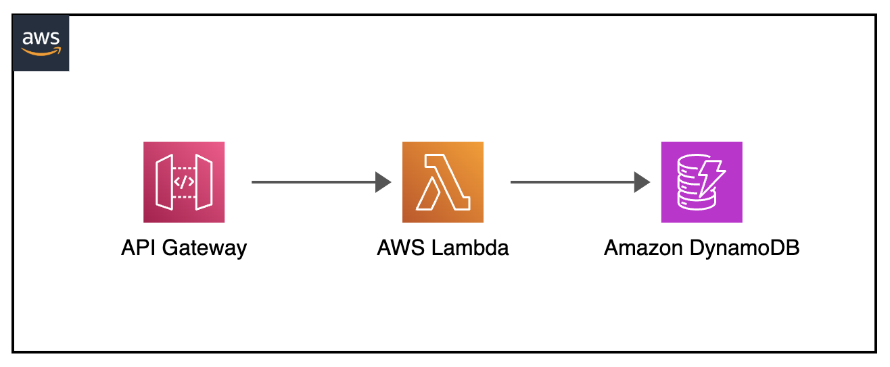
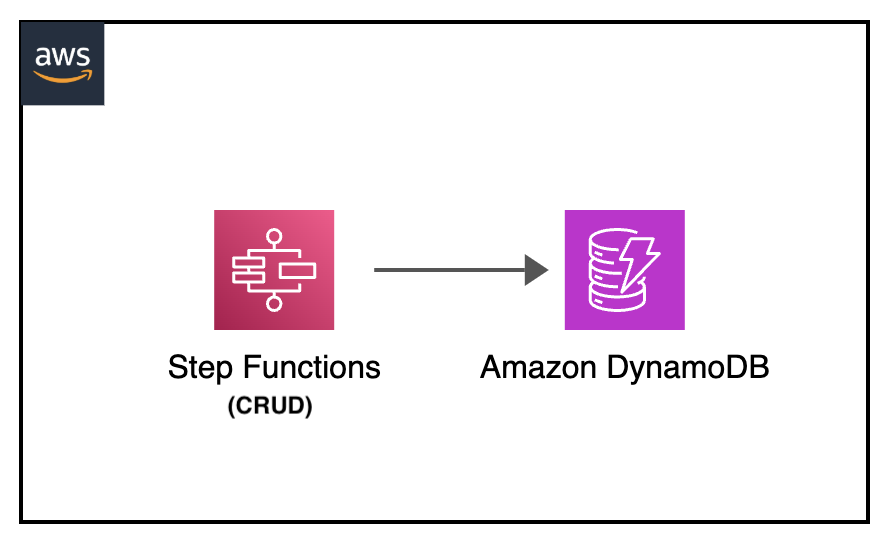

# Serverless local testing repository

### Table of contents

- [Abstract](#abstract)
- [Main folder structure](#main-folder-structure)
- [Requirements, assumptions and best practices](#requirements--assumptions-and-best-practices)
- [Unit Testing - API Gateway - MOCK (SAM API Gateway emulator)](#unit-testing---api-gateway---mock--sam-api-gateway-emulator-)
- [Unit Testing - API Gateway - CRUD + Lambda + DynamoDB (SAM API Gateway emulator + SAM Lambda emulator + DynamoDB Docker image)](#unit-testing---api-gateway---crud---lambda---dynamodb--sam-api-gateway-emulator---sam-lambda-emulator---dynamodb-docker-image-)
- [Unit Testing - DynamoDB - CRUD + aws cli (DynamoDB Docker image + aws cli)](#unit-testing---dynamodb---crud---aws-cli--dynamodb-docker-image---aws-cli-)
- [Unit Testing - DynamoDB - CRUD + Lambda (DynamoDB Docker image + Lambda functions)](#unit-testing---dynamodb---crud---lambda--dynamodb-docker-image---lambda-functions-)
- [Unit Testing - DynamoDB - CRUD + Step Functions (DynamoDB Docker image + Step Functions Docker image)](#unit-testing---dynamodb---crud---step-functions--dynamodb-docker-image---step-functions-docker-image-)
- [Unit Testing - Lambda - Hello World (SAM Lambda emulator)](#unit-testing---lambda---hello-world--sam-lambda-emulator-)
- [Unit Testing - Lambda - Layers (SAM Lambda emulator)](#unit-testing---lambda---layers--sam-lambda-emulator-)
- [Unit Testing - Step Functions - Hello World (Step Functions Docker image)](#unit-testing---step-functions---hello-world--step-functions-docker-image-)
- [Unit Testing - Step Functions - MOCK (Step Functions Docker image + aws cli)](#unit-testing---step-functions---mock--step-functions-docker-image---aws-cli-)
- [Unit Testing - Step Functions + Lambda (Step Functions Docker image + SAM Lambda emulator)](#unit-testing---step-functions---lambda--step-functions-docker-image---sam-lambda-emulator-)
- [Debugging](#debugging)
  - [DynamoDB - Getting Logs](#dynamodb---getting-logs)
  - [DynamoDB - Adding commmand line switch parameters](#dynamodb---adding-commmand-line-switch-parameters)
  - [DynamoDB - GUI Clients](#dynamodb---gui-clients)
  - [Step Functions - Get execution details --debug](#step-functions---get-execution-details---debug)
  - [Step Functions - States workflow](#step-functions---states-workflow)
  - [Step Functions - Visual machine state definition](#step-functions---visual-machine-state-definition)
  - [Docker - Check container logs](#docker---checking-container-logs)
  - [Docker - Checking local environment variables](#docker---checking-local-environment-variables)
  - [Docker - Checking resultant mounted file](#docker---checking-resultant-mounted-file)
  - [Docker - Network comunication between Docker internel networks](#docker---network-comunication-between-docker-internel-networks)
- [Possible future upgrades and improvements](#possible-future-upgrades-and-improvements)
- [Additional References](#additional-references)

### Abstract

This repository provides practical examples and guidance for running popular AWS serverless services in a local development environment. It aims to demonstrate specific use cases and best practices for local serverless development.

The repository includes examples for the following AWS serverless services:
- AWS Lambda
- Amazon API Gateway
- Amazon DynamoDB
- AWS Step Functions

#### Why running serverless services locally

- Isolated environments: In some isolated or edge computing scenarios, running serverless services locally may be the only option (eg. AWS Snowball).
- Velocity: Local deployments can be faster for testing and development purposes and have a reduced latency for certain applications.
- Legal requirements: Some regions may have legal requirements that prevent data from leaving specific geographic boundaries.
- Legacy testing compatibility: step by step upgrade and testing with minor upgrades rather than upgrating state of the art versins (EG: Lambda Functions)
- Other hyperscalers compatibility: running containarized versions of AWS serverless versions on other cloud providers (EG: Managed Kubernetes)

### Main folder structure

Each service has its own directory with necessary execution files, distributed as follows:

```
├── README.md                           _# original project documentation_
├── apigateway-crud-lambda-dynamodb     _# folder containing necessary code and template for CRUD operations with API Gateway, Lambda Functions and DynamoDB_
│   ├── events                          _# folder containing json files for API Gateway CRUD input events_
│   ├── lambda_crud_src                 _# folder containing code for different CRUD Lambda functions_
│   └── template.yaml                   _# sam yaml template file for necessary components test_
├── apigateway-mock                     _# folder containing necessary code and template for mocking API Gateway with Lambda funcions_
│   ├── lambda_mock_src                 _# folder containing code for the MOCK Lambda function_
│   └── template.yaml                   _# sam yaml template file for necessary components test_
├── dynamodb-crud-cli                   _# folder containing json files for aws cli DynamoDB CRUD operations_
├── dynamodb-crud-lambda                _# folder containing necessary code and template for Lambda DynamoDB CRUD operations_
│   ├── events                          _# folder containing json files for Lambda DynamoDB CRUD operations_
│   ├── lambda_crud_src                 _# folder containing code for different CRUD Lambda functions_
│   └── template.yaml                   _# sam yaml template file for necessary components test_
├── dynamodb-crud-stepfunctions         _# folder containing environment variables file and json file defining state machine implementing DynamoDB CRUD operations_
├── lambda-sam-helloworld               _# folder containing necessary code and template for Hello World Lambda_
│   ├── events                          _# folder containing json files for Hello World Lambda input events_
│   ├── lambda_helloworld_src           _# folder containing code Hello World Lambda function_
│   └── template.yaml                   _# sam yaml template file for necessary components test_
├── lambda-sam-layers                   _# folder containing necessary code and template for Lambda Layers implementation_
│   ├── custom-lambda-layer             _# folder containing python dependencies (requirements.txt)_
│   ├── events                          _# folder containing json files for Lambda Layers input events_
│   ├── lambda_layers_src               _# folder containing source code for Lambda Layers function_
│   └── template.yaml                   _# sam yaml template file for necessary components test_
├── stepfunctions-helloworld            _# folder containing environment variables file for Hello World Step Functions_
├── stepfunctions-lambda                _# folder containing necessary code and template for Step Functions with Lambda integration_
│   ├── aws-stepfunctions-local-credentials.txt    _# file containing environment variables for Step Functions with Lambda integration_
│   ├── lambda_stepfunctions_src        _# folder containing source code for Step Functions Lambda functions_
│   └── template.yaml                   _# sam yaml template file for necessary components test_
└── stepfunctions-mock                  _# folder containing necessary files for mocking Step Functions_
    ├── MockConfigFile.json             _# fjson file defining state machine implementing MOCK Step Functions_
    ├── aws-stepfunctions-local-credentials.txt     _# file containing environment variables for mocking Step Functions_
    └── statemachine.json               _# json configuration file containing step machines definition for Step Functions MOCK testing_
└── img                                 _# folder containing diagram pictures of each test_
```

### Requirements, assumptions and best practices

#### Requirements

- [aws cli](https://docs.aws.amazon.com/cli/latest/userguide/getting-started-install.html) AWS cli installed
- [aws sam cli](https://docs.aws.amazon.com/serverless-application-model/latest/developerguide/install-sam-cli.html) AWS Serverless Application Model (SAM) framework installed
- [Docker](https://docs.docker.com/engine/install) docker daemon is running (for local AWS SAM testing)

#### Restrictions and best practices

- AWS SAM (Serverless Application Model) requires code to be in separate files for local execution.
- Rebuild the SAM application after code changes and before local testing. If your application has a .aws-sam directory from running sam build, be sure to run sam build every time you update your function code. Then, run sam local invoke to locally test your updated function code.
- Local versions of serverless services may not have all the features or latest updates available in the cloud versions.
- Regularly update local tools and emulators to ensure compatibility with cloud services.
- [DynamoDB local usage notes](https://docs.aws.amazon.com/amazondynamodb/latest/developerguide/DynamoDBLocal.UsageNotes.html)
- [SAM local invoke - Best practices](https://docs.aws.amazon.com/serverless-application-model/latest/developerguide/using-sam-cli-local-invoke.html#using-sam-cli-local-invoke-best)

### Unit Testing - API Gateway - MOCK (SAM API Gateway emulator)

<p align="center">
  
</center>

#### Test Features

- API Code: json mock
- Lambda code: nodejs
- Services Tested: API Gateway + AWS Lambda
- Dummy AWS credentials and region needed: No
- Code folder: [apigateway-mock](apigateway-mock)
- [API Gateway Docs SAM] [AWS Serverless Application Model - Developer Guide - Locally run API Gateway with AWS SAM](https://docs.aws.amazon.com/serverless-application-model/latest/developerguide/serverless-sam-cli-using-start-api.html)
- [API Gateway Docs hello-world] [Introduction to testing with sam local start-api](https://docs.aws.amazon.com/serverless-application-model/latest/developerguide/using-sam-cli-local-start-api.html)

#### Unit Testing

Entering to code folder

```sh
cd apigateway-mock
```

Running api code (template.yaml file)

```sh
sam local start-api &
```

<details>
  <summary>Command output</summary>

  No current session found, using default AWS::AccountId

  Mounting LambdaMockFunction at http://127.0.0.1:3000/MOCK [GET]
  You can now browse to the above endpoints to invoke your functions. You do not need to restart/reload SAM CLI while working on your functions, changes will be reflected
  instantly/automatically. If you used sam build before running local commands, you will need to re-run sam build for the changes to be picked up. You only need to restart
  SAM CLI if you update your AWS SAM template

  2024-12-21 08:54:09 WARNING: This is a development server. Do not use it in a production deployment. Use a production WSGI server instead.

  * Running on http://127.0.0.1:3000
  2024-12-21 08:54:09 Press CTRL+C to quit

</details>


```sh
curl http://127.0.0.1:3000/MOCK
```

<details>
  <summary>Command output</summary>

  Invoking app.lambdaHandler (nodejs18.x)
  Local image was not found.
  Removing rapid images for repo public.ecr.aws/sam/emulation-nodejs18.x
  Building image..............................................................................................................
  Using local image: public.ecr.aws/lambda/nodejs:18-rapid-x86_64.

  Mounting /home/ubuntu/apigateway-mock/lambda_mock_src as /var/task:ro,delegated, inside runtime container
  START RequestId: 783ccf31-14ab-4bf9-a794-bafb53f05381 Version: $LATEST
  END RequestId: ca7f16f2-19b8-4a31-86f9-917e8ee4c525
  REPORT RequestId: ca7f16f2-19b8-4a31-86f9-917e8ee4c525 Init Duration: 0.04 ms Duration: 458.67 ms Billed Duration: 459 ms Memory Size: 128 MB Max Memory Used: 128 MB 

  No Content-Type given. Defaulting to 'application/json'.
  2024-12-21 08:57:56 127.0.0.1 - - [21/Dec/2024 08:57:56] "GET /MOCK HTTP/1.1" 200 -
  "This is mock response"

</details>


### Unit Testing - API Gateway - CRUD + Lambda + DynamoDB (SAM API Gateway emulator + SAM Lambda emulator + DynamoDB Docker image)

<p align="center">
  
</center>

#### Test Features

- API Code: json
- Lambda code: python
- Services Tested: API Gateway + AWS Lambda + DynamoDB
- Dummy AWS credentials and region needed: No
- Code folder: [apigateway-crud-lambda-dynamodb](apigateway-crud-lambda-dynamodb)
- [API Gateway Docs SAM] [AWS Serverless Application Model - Developer Guide - Locally run API Gateway with AWS SAM](https://docs.aws.amazon.com/serverless-application-model/latest/developerguide/serverless-sam-cli-using-start-api.html)
- [Lambda Docs SAM] [AWS Serverless Application Model - Developer Guide - Locally invoke Lambda functions with AWS SAM](https://docs.aws.amazon.com/serverless-application-model/latest/developerguide/serverless-sam-cli-using-invoke.html)
- [Amazon DynamoDB Developer Guide] [Amazon DynamoDB - Developer Guide - Deploying DynamoDB locally on your computer](https://docs.aws.amazon.com/amazondynamodb/latest/developerguide/DynamoDBLocal.DownloadingAndRunning.html)

#### Unit Testing

Entering to code folder

```sh
cd apigateway-crud-lambda-dynamodb
```

Starting DynamoDB Docker image as backend endpoint

- https://docs.docker.com/reference/cli/docker/container/run/

```sh
docker run --rm -d --network host -p 8000:8000 amazon/dynamodb-local
```

<details>
  <summary>Command output</summary>

  Initializing DynamoDB Local with the following configuration:
  Port: 8000
  InMemory: true
  Version: 2.5.3
  DbPath: null
  SharedDb: false
  shouldDelayTransientStatuses: false
  CorsParams: null

</details>

Running api code (template.yaml file)

```sh
sam local start-api --docker-network host &
```

<details>
  <summary>Command output</summary>
                                                                            
  Mounting CRUDLambdaDeleteFunction at http://127.0.0.1:3000/delete [GET]
  Mounting CRUDLambdaInitFunction at http://127.0.0.1:3000/init [GET]
  Mounting CRUDLambdaReadFunction at http://127.0.0.1:3000/read [GET]
  Mounting CRUDLambdaUpdateFunction at http://127.0.0.1:3000/update [POST]
  Mounting CRUDLambdaCreateFunction at http://127.0.0.1:3000/create [POST]
  You can now browse to the above endpoints to invoke your functions. You do not need to restart/reload SAM CLI while working on your functions, changes will be reflected
  instantly/automatically. If you used sam build before running local commands, you will need to re-run sam build for the changes to be picked up. You only need to restart
  SAM CLI if you update your AWS SAM template
  2024-12-21 09:03:57 WARNING: This is a development server. Do not use it in a production deployment. Use a production WSGI server instead.
  * Running on http://127.0.0.1:3000
  2024-12-21 09:03:57 Press CTRL+C to quit

</details>

Calling API Gateway init endpoint to tun lambda locally (lambda_crud_src/lambda_crud_init_src/app-py + template.yaml files) to create necessary table (CRUDLocalTable)

```sh
curl -X GET  http://127.0.0.1:3000/init
```

<details>
  <summary>Command output</summary>

  Invoking app.lambda_handler (python3.9)
  Local image was not found.
  Removing rapid images for repo public.ecr.aws/sam/emulation-python3.9
  Building image......................................................................................................................................................................
  Using local image: public.ecr.aws/lambda/python:3.9-rapid-x86_64.

  Mounting /home/ubuntu/apigateway-crud-lambda-dynamodb/lambda_crud_src/lambda_crud_init_src as /var/task:ro,delegated, inside runtime container
  START RequestId: 39710002-856d-4d85-b073-25b355fb7ab4 Version: $LATEST
  Table created successfully: CRUDLocalTable
  END RequestId: ab4cf198-4aeb-44ed-bd27-0160c7360aed
  REPORT RequestId: ab4cf198-4aeb-44ed-bd27-0160c7360aed Init Duration: 0.03 ms Duration: 1663.04 ms Billed Duration: 1664 ms Memory Size: 128 MB Max Memory Used: 128 MB 

  No Content-Type given. Defaulting to 'application/json'.
  2024-12-21 09:12:27 127.0.0.1 - - [21/Dec/2024 09:12:27] "GET /init HTTP/1.1" 200 -
  CRUDLocalTableroot

</details>

Creating initial item into previously created table (CRUDLocalTable)
```sh
curl -X POST http://127.0.0.1:3000/create \
  -H 'Content-Type: application/json' \
  -d '{"Id": "123", "name": "Batman"}'
```

<details>
  <summary>Command output</summary>

  Invoking app.lambda_handler (python3.9)
  Local image is up-to-date
  Using local image: public.ecr.aws/lambda/python:3.9-rapid-x86_64.

  Mounting /home/ubuntu/apigateway-crud-lambda-dynamodb/lambda_crud_src/lambda_crud_create_src as /var/task:ro,delegated, inside runtime container
  START RequestId: 671d6c48-f025-4469-bcbc-5698fad8b066 Version: $LATEST
  END RequestId: d3ab486d-ea44-4981-b8ef-abc54412c8f2
  REPORT RequestId: d3ab486d-ea44-4981-b8ef-abc54412c8f2 Init Duration: 0.03 ms Duration: 507.07 ms Billed Duration: 508 ms Memory Size: 128 MB Max Memory Used: 128 MB 

  No Content-Type given. Defaulting to 'application/json'.
  2024-12-21 09:14:51 127.0.0.1 - - [21/Dec/2024 09:14:51] "POST /create HTTP/1.1" 200 -
  {"message": "Item added", "response": {"ResponseMetadata": {"RequestId": "6a0c0fb7-5124-4447-a58a-6ab9120f79fc", "HTTPStatusCode": 200, "HTTPHeaders": {"server": "Jetty(12.0.8)", "date": "Sat, 21 Dec 2024 09:14:51 GMT", "x-amzn-requestid": "6a0c0fb7-5124-4447-a58a-6ab9120f79fc", "content-type": "application/x-amz-json-1.0", "x-amz-crc32": "2745614147", "content-length": "2"}, "RetryAttempts": 0}}}

</details>

Reading item (CRUDLocalTable)

```sh
curl -X GET  http://127.0.0.1:3000/read \
  -H 'Content-Type: application/json' \
  -d '{"Id": "123"}'
```

<details>
  <summary>Command output</summary>

  Invoking app.lambda_handler (python3.9)
  Using local image: public.ecr.aws/lambda/python:3.9-rapid-x86_64.

  Mounting /home/ubuntu/apigateway-crud-lambda-dynamodb/lambda_crud_src/lambda_crud_read_src as /var/task:ro,delegated, inside runtime container
  START RequestId: f84f50b8-4673-4f1c-94d1-d9285157c197 Version: $LATEST
  END RequestId: cd00fd84-cabb-42f1-a166-c40ad6331c6d
  REPORT RequestId: cd00fd84-cabb-42f1-a166-c40ad6331c6d Init Duration: 0.05 ms Duration: 317.91 ms Billed Duration: 318 ms Memory Size: 128 MB Max Memory Used: 128 MB 

  No Content-Type given. Defaulting to 'application/json'.
  2024-12-21 09:16:02 127.0.0.1 - - [21/Dec/2024 09:16:02] "GET /read HTTP/1.1" 200 -
  {'name': 'Batman', 'Id': '123'}

</details>

Updating previously created item (CRUDLocalTable)

```sh
curl -X POST http://127.0.0.1:3000/update \
  -H 'Content-Type: application/json' \
  -d '{"Id": "123", "name": "Robin"}'
```

<details>
  <summary>Command output</summary>

  Invoking app.lambda_handler (python3.9)
  Using local image: public.ecr.aws/lambda/python:3.9-rapid-x86_64.

  Mounting /home/ubuntu/apigateway-crud-lambda-dynamodb/lambda_crud_src/lambda_crud_update_src as /var/task:ro,delegated, inside runtime container
  START RequestId: aeffc132-02d6-43c4-860a-08b4e0f757f0 Version: $LATEST
  END RequestId: 1745ace7-00e6-4ef3-a61c-a47c3c14a33d
  REPORT RequestId: 1745ace7-00e6-4ef3-a61c-a47c3c14a33d Init Duration: 0.03 ms Duration: 440.97 ms Billed Duration: 441 ms Memory Size: 128 MB Max Memory Used: 128 MB 

  No Content-Type given. Defaulting to 'application/json'.
  2024-12-21 09:16:41 127.0.0.1 - - [21/Dec/2024 09:16:41] "POST /update HTTP/1.1" 200 -
  {"message": "Item updated successfully", "response": {"Attributes": {"name": "Robin"}, "ResponseMetadata": {"RequestId": "797ecbfa-8da7-4dc0-9a47-d3ccaf4985c9", "HTTPStatusCode": 200, "HTTPHeaders": {"server": "Jetty(12.0.8)", "date": "Sat, 21 Dec 2024 09:16:41 GMT", "x-amzn-requestid": "797ecbfa-8da7-4dc0-9a47-d3ccaf4985c9", "content-type": "application/x-amz-json-1.0", "x-amz-crc32": "945407983", "content-length": "37"}, "RetryAttempts": 0}}}

</details>

Getting item (CRUDLocalTable)

```sh
curl -X GET http://127.0.0.1:3000/read \
  -H 'Content-Type: application/json' \
  -d '{"Id": "123"}'
```

<details>
  <summary>Command output</summary>

  Invoking app.lambda_handler (python3.9)
  Using local image: public.ecr.aws/lambda/python:3.9-rapid-x86_64.

  Mounting /home/ubuntu/apigateway-crud-lambda-dynamodb/lambda_crud_src/lambda_crud_read_src as /var/task:ro,delegated, inside runtime container
  START RequestId: dabc803e-d3bf-48f8-b873-5c27b6187a8d Version: $LATEST
  END RequestId: 43d36146-1205-4495-b235-5d07a2f6efce
  REPORT RequestId: 43d36146-1205-4495-b235-5d07a2f6efce Init Duration: 0.03 ms Duration: 297.27 ms Billed Duration: 298 ms Memory Size: 128 MB Max Memory Used: 128 MB 

  No Content-Type given. Defaulting to 'application/json'.
  2024-12-21 09:17:14 127.0.0.1 - - [21/Dec/2024 09:17:14] "GET /read HTTP/1.1" 200 -
  {'name': 'Robin', 'Id': '123'}

</details>

Deleting item (CRUDLocalTable)

```sh
curl -X GET http://127.0.0.1:3000/delete \
  -H 'Content-Type: application/json' \
  -d '{"Id": "123"}'
```

<details>
  <summary>Command output</summary>

  Invoking app.lambda_handler (python3.9)
  Using local image: public.ecr.aws/lambda/python:3.9-rapid-x86_64.

  Mounting /home/ubuntu/apigateway-crud-lambda-dynamodb/lambda_crud_src/lambda_crud_delete_src as /var/task:ro,delegated, inside runtime container
  END RequestId: adf007b0-bb56-47de-b02c-dd88da9b2c04
  REPORT RequestId: adf007b0-bb56-47de-b02c-dd88da9b2c04 Init Duration: 0.03 ms Duration: 513.70 ms Billed Duration: 514 ms Memory Size: 128 MB Max Memory Used: 128 MB 

  No Content-Type given. Defaulting to 'application/json'.
  2024-12-21 09:17:41 127.0.0.1 - - [21/Dec/2024 09:17:41] "GET /delete HTTP/1.1" 200 -
  {"message": "Item deleted", "response": {"ResponseMetadata": {"RequestId": "fc61cd7b-4ac1-4786-87a6-c33915c47770", "HTTPStatusCode": 200, "HTTPHeaders": {"server": "Jetty(12.0.8)", "date": "Sat, 21 Dec 2024 09:17:41 GMT", "x-amzn-requestid": "fc61cd7b-4ac1-4786-87a6-c33915c47770", "content-type": "application/x-amz-json-1.0", "x-amz-crc32": "2745614147", "content-length": "2"}, "RetryAttempts": 0}}}

</details>

Getting item (CRUDLocalTable)
```sh
curl -X GET http://127.0.0.1:3000/read \
  -H 'Content-Type: application/json' \
  -d '{"Id": "123"}'
```

<details>
  <summary>Command output</summary>

  Invoking app.lambda_handler (python3.9)
  Using local image: public.ecr.aws/lambda/python:3.9-rapid-x86_64.

  Mounting /home/ubuntu/apigateway-crud-lambda-dynamodb/lambda_crud_src/lambda_crud_read_src as /var/task:ro,delegated, inside runtime container
  END RequestId: c0e00452-9e5c-4b91-884f-56d82e2d9fa6
  REPORT RequestId: c0e00452-9e5c-4b91-884f-56d82e2d9fa6 Init Duration: 0.02 ms Duration: 418.27 ms Billed Duration: 419 ms Memory Size: 128 MB Max Memory Used: 128 MB 

  No Content-Type given. Defaulting to 'application/json'.
  2024-12-21 09:23:54 127.0.0.1 - - [21/Dec/2024 09:23:54] "GET /read HTTP/1.1" 404 -
  {"error": "Item not found", "message": "No item with Id 123 found"}

</details>

### Unit Testing - DynamoDB - CRUD + aws cli (DynamoDB Docker image + aws cli)

<p align="center">
  
</center>

#### Test Features

- DynamoDB code: aws cli commands
- Services Tested: DynamoDB
- Dummy AWS credentials and region needed: Yes
- Code folder: [dynamodb-crud-cli](dynamodb-crud-cli)
- [Amazon DynamoDB Developer Guide] [Amazon DynamoDB - Developer Guide - Deploying DynamoDB locally on your computer](https://docs.aws.amazon.com/amazondynamodb/latest/developerguide/DynamoDBLocal.DownloadingAndRunning.html)
- [aws cli dynamodb] [AWS CLI Command Reference - aws dynamodb](https://awscli.amazonaws.com/v2/documentation/api/latest/reference/dynamodb/index.html)

#### Unit Testing

Entering to code folder

```sh
cd dynamodb-crud-cli
```

Starting DynamoDB Docker image as backend endpoint
- https://docs.docker.com/reference/cli/docker/container/run
```sh
docker run --rm -d --network host -p 8000:8000 amazon/dynamodb-local
```

Setting dummy credentials

```sh
export AWS_ACCESS_KEY_ID='DUMMYIDEXAMPLE'
export AWS_SECRET_ACCESS_KEY='DUMMYEXAMPLEKEY'
export REGION='eu-west-1'
```

Creating necessary table (CRUDLocalTable)

- https://awscli.amazonaws.com/v2/documentation/api/latest/reference/dynamodb/list-tables.html

```sh
aws dynamodb list-tables --endpoint-url http://localhost:8000
```

<details>
  <summary>Command output</summary>

  {
      "TableNames": []
  }
  
</details>

- https://awscli.amazonaws.com/v2/documentation/api/latest/reference/dynamodb/create-table.html

```sh
aws dynamodb create-table --endpoint-url http://localhost:8000  \
    --table-name CRUDLocalTable                                 \
    --attribute-definitions AttributeName=Id,AttributeType=S    \
    --key-schema AttributeName=Id,KeyType=HASH                  \
    --billing-mode PAY_PER_REQUEST
```

<details>
  <summary>Command output</summary>

  {
      "TableDescription": {
          "AttributeDefinitions": [
              {
                  "AttributeName": "Id",
                  "AttributeType": "S"
              }
          ],
          "TableName": "CRUDLocalTable",
          "KeySchema": [
              {
                  "AttributeName": "Id",
                  "KeyType": "HASH"
              }
          ],
          "TableStatus": "ACTIVE",
          "CreationDateTime": "2024-12-21T09:35:08.848000+00:00",
          "ProvisionedThroughput": {
              "LastIncreaseDateTime": "1970-01-01T00:00:00+00:00",
              "LastDecreaseDateTime": "1970-01-01T00:00:00+00:00",
              "NumberOfDecreasesToday": 0,
              "ReadCapacityUnits": 0,
              "WriteCapacityUnits": 0
          },
          "TableSizeBytes": 0,
          "ItemCount": 0,
          "TableArn": "arn:aws:dynamodb:ddblocal:000000000000:table/CRUDLocalTable",
          "BillingModeSummary": {
              "BillingMode": "PAY_PER_REQUEST",
              "LastUpdateToPayPerRequestDateTime": "2024-12-21T09:35:08.848000+00:00"
          },
          "DeletionProtectionEnabled": false
      }
  }

</details>


- https://awscli.amazonaws.com/v2/documentation/api/latest/reference/dynamodb/describe-table.html

```sh
aws dynamodb describe-table --endpoint-url http://localhost:8000 \
    --table-name CRUDLocalTable
```

<details>
  <summary>Command output</summary>

  {
      "Table": {
          "AttributeDefinitions": [
              {
                  "AttributeName": "Id",
                  "AttributeType": "S"
              }
          ],
          "TableName": "CRUDLocalTable",
          "KeySchema": [
              {
                  "AttributeName": "Id",
                  "KeyType": "HASH"
              }
          ],
          "TableStatus": "ACTIVE",
          "CreationDateTime": "2024-12-21T09:35:08.848000+00:00",
          "ProvisionedThroughput": {
              "LastIncreaseDateTime": "1970-01-01T00:00:00+00:00",
              "LastDecreaseDateTime": "1970-01-01T00:00:00+00:00",
              "NumberOfDecreasesToday": 0,
              "ReadCapacityUnits": 0,
              "WriteCapacityUnits": 0
          },
          "TableSizeBytes": 0,
          "ItemCount": 0,
          "TableArn": "arn:aws:dynamodb:ddblocal:000000000000:table/CRUDLocalTable",
          "BillingModeSummary": {
              "BillingMode": "PAY_PER_REQUEST",
              "LastUpdateToPayPerRequestDateTime": "2024-12-21T09:35:08.848000+00:00"
          },
          "DeletionProtectionEnabled": false
      }
  }

</details>

Creating initial item (create-item.json file) into previously created table (CRUDLocalTable)

- https://awscli.amazonaws.com/v2/documentation/api/latest/reference/dynamodb/put-item.html

```sh
aws dynamodb put-item --endpoint-url http://localhost:8000  \
    --table-name CRUDLocalTable                             \
    --item file://create-item.json                          \
    --return-consumed-capacity TOTAL                        \
    --return-item-collection-metrics SIZE
```

<details>
  <summary>Command output</summary>

  {
      "ConsumedCapacity": {
          "TableName": "CRUDLocalTable",
          "CapacityUnits": 1.0
      }
  }

</details>

Listing table contents (CRUDLocalTable)

- https://awscli.amazonaws.com/v2/documentation/api/latest/reference/dynamodb/scan.html

```sh
aws dynamodb scan --endpoint-url http://localhost:8000 \
    --table-name CRUDLocalTable
```

<details>
  <summary>Command output</summary>

  {
      "Items": [
          {
              "name": {
                  "S": "Batman"
              },
              "Id": {
                  "S": "123"
              }
          }
      ],
      "Count": 1,
      "ScannedCount": 1,
      "ConsumedCapacity": null
  }

</details>

Updating previously created item (update-values.json)
- https://awscli.amazonaws.com/v2/documentation/api/latest/reference/dynamodb/update-item.html

```sh
aws dynamodb update-item --endpoint-url http://localhost:8000   \
    --table-name CRUDLocalTable                                 \
    --key '{"Id": {"S": "123"}}'                                \
    --update-expression "SET #name = :n, age = :a"              \
    --expression-attribute-names '{"#name": "name"}'            \
    --expression-attribute-values file://update-item.json       \
    --return-values ALL_NEW
```

<details>
  <summary>Command output</summary>

  {
      "Attributes": {
          "name": {
              "S": "Robin"
          },
          "age": {
              "N": "35"
          },
          "Id": {
              "S": "123"
          }
      }
  }

</details>

Checking table contents (CRUDLocalTable)

- https://awscli.amazonaws.com/v2/documentation/api/latest/reference/dynamodb/scan.html

```sh
aws dynamodb scan --endpoint-url http://localhost:8000 \
    --table-name CRUDLocalTable
```

<details>
  <summary>Command output</summary>

  {
      "Items": [
          {
              "name": {
                  "S": "Robin"
              },
              "age": {
                  "N": "35"
              },
              "Id": {
                  "S": "123"
              }
          }
      ],
      "Count": 1,
      "ScannedCount": 1,
      "ConsumedCapacity": null
  }

</details>

Deleting item (delete-item.json)

- https://awscli.amazonaws.com/v2/documentation/api/latest/reference/dynamodb/delete-item.html

```sh
aws dynamodb delete-item --endpoint-url http://localhost:8000   \
    --table-name CRUDLocalTable                                 \
    --key file://delete-item.json                               \
    --return-values ALL_OLD                                     \
    --return-consumed-capacity TOTAL                            \
    --return-item-collection-metrics SIZE
```

<details>
  <summary>Command output</summary>

  {
      "Attributes": {
          "name": {
              "S": "Robin"
          },
          "age": {
              "N": "35"
          },
          "Id": {
              "S": "123"
          }
      },
      "ConsumedCapacity": {
          "TableName": "CRUDLocalTable",
          "CapacityUnits": 1.0
      }
  }

</details>


Checking table contents (CRUDLocalTable)

- https://awscli.amazonaws.com/v2/documentation/api/latest/reference/dynamodb/scan.html

```sh
aws dynamodb scan --endpoint-url http://localhost:8000 \
    --table-name CRUDLocalTable
```

<details>
  <summary>Command output</summary>

  {
      "Items": [],
      "Count": 0,
      "ScannedCount": 0,
      "ConsumedCapacity": null
  }

</details>

### Unit Testing - DynamoDB - CRUD + Lambda (DynamoDB Docker image + Lambda functions)

<p align="center">
  
</center>

#### Test Features

- Lambda code: python
- Services Tested: DynamoDB + AWS Lambda
- Dummy AWS credentials and region needed: Yes
- Code folder: [dynamodb-crud-lambda](dynamodb-crud-lambda)
- [Amazon DynamoDB Developer Guide] [Amazon DynamoDB - Developer Guide - Deploying DynamoDB locally on your computer](https://docs.aws.amazon.com/amazondynamodb/latest/developerguide/DynamoDBLocal.DownloadingAndRunning.html)
- [Lambda Docs SAM] [AWS Serverless Application Model - Developer Guide - Locally invoke Lambda functions with AWS SAM](https://docs.aws.amazon.com/serverless-application-model/latest/developerguide/serverless-sam-cli-using-invoke.html)

#### Unit Testing

Entering to code folder
```sh
cd dynamodb-crud-lambda
```

Starting DynamoDB Docker image as backend endpoint

- https://docs.docker.com/reference/cli/docker/container/run/

```sh
docker run --rm -d --network host -p 8000:8000 amazon/dynamodb-local
```

Setting dummy credentials

```sh
export AWS_ACCESS_KEY_ID='DUMMYIDEXAMPLE'
export AWS_SECRET_ACCESS_KEY='DUMMYEXAMPLEKEY'
export REGION='eu-west-1'
```

Running lambda locally (lambda_crud_src/lambda_crud_init_src/app.py + events/lambda-init-event.json +  template.yaml files) to create necessary table (CRUDLocalTable)

- https://docs.aws.amazon.com/serverless-application-model/latest/developerguide/sam-cli-command-reference-sam-local-invoke.html

```sh
sam local invoke CRUDLambdaInitFunction     \
    --docker-network host                   \
    --event events/lambda-init-event.json
```

<details>
  <summary>Command output</summary>

  No current session found, using default AWS::AccountId
  Invoking app.lambda_handler (python3.9)
  Local image was not found.
  Removing rapid images for repo public.ecr.aws/sam/emulation-python3.9
  Building image...........................................................................................................................................................................
  Using local image: public.ecr.aws/lambda/python:3.9-rapid-x86_64.

  Mounting /home/ubuntu/apigateway-crud-lambda-dynamodb/lambda_crud_src/lambda_crud_init_src as /var/task:ro,delegated, inside runtime container
  Table created successfully: CRUDLocalTable
  END RequestId: a3ecbc19-04ec-4961-b072-83d2f76a3d80
  REPORT RequestId: a3ecbc19-04ec-4961-b072-83d2f76a3d80	Init Duration: 0.03 ms	Duration: 1901.38 ms	Billed Duration: 1902 ms	Memory Size: 128 MB	Max Memory Used: 128 MB	
  {"statusCode": 200, "body": "CRUDLocalTable"}

  SAM CLI update available (1.132.0); (1.131.0 installed)
  To download: https://docs.aws.amazon.com/serverless-application-model/latest/developerguide/serverless-sam-cli-install.html

</details>

Running lambda locally (lambda_crud_src/lambda_crud_create_src/app-py + events/lambda-create-event.json + template.yaml files) to create initial item (CRUDLocalTable)

- https://docs.aws.amazon.com/serverless-application-model/latest/developerguide/sam-cli-command-reference-sam-local-invoke.html

```sh
sam local invoke CRUDLambdaCreateFunction   \
    --docker-network host         \
    --event events/lambda-create-event.json
```

<details>
  <summary>Command output</summary>

  No current session found, using default AWS::AccountId
  Invoking app.lambda_handler (python3.9)
  Local image is up-to-date
  Using local image: public.ecr.aws/lambda/python:3.9-rapid-x86_64.

  Mounting /home/ubuntu/apigateway-crud-lambda-dynamodb/lambda_crud_src/lambda_crud_create_src as /var/task:ro,delegated, inside runtime container
  START RequestId: 2c701608-d2ba-4412-980b-5fe5263b5667 Version: $LATEST
  END RequestId: 2a922c9d-75f5-4726-b2ec-ab94da3e22b0
  REPORT RequestId: 2a922c9d-75f5-4726-b2ec-ab94da3e22b0 Init Duration: 0.05 ms Duration: 350.40 ms Billed Duration: 351 ms Memory Size: 128 MB Max Memory Used: 128 MB 
  {"statusCode": 200, "body": "{\"message\": \"Item added\", \"response\": {\"ResponseMetadata\": {\"RequestId\": \"a8694991-7e36-4460-860b-eb8a5795bfe5\", \"HTTPStatusCode\": 200, \"HTTPHeaders\": {\"server\": \"Jetty(12.0.8)\", \"date\": \"Sat, 21 Dec 2024 09:51:08 GMT\", \"x-amzn-requestid\": \"a8694991-7e36-4460-860b-eb8a5795bfe5\", \"content-type\": \"application/x-amz-json-1.0\", \"x-amz-crc32\": \"2745614147\", \"content-length\": \"2\"}, \"RetryAttempts\": 0}}}"}

</details>

Running lambda locally (lambda_crud_src/lambda_crud_read_src/app-py + events/lambda-read-event.json + template.yaml files) to list table contents (CRUDLocalTable)

- https://docs.aws.amazon.com/serverless-application-model/latest/developerguide/sam-cli-command-reference-sam-local-invoke.html

```sh
sam local invoke CRUDLambdaReadFunction      \
    --docker-network host                    \
    --event events/lambda-read-event.json
```

<details>
  <summary>Command output</summary>

  No current session found, using default AWS::AccountId
  Invoking app.lambda_handler (python3.9)
  Local image is up-to-date
  Using local image: public.ecr.aws/lambda/python:3.9-rapid-x86_64.

  Mounting /home/ubuntu/dynamodb-crud-lambda/lambda_crud_src/lambda_crud_read_src as /var/task:ro,delegated, inside runtime container
  START RequestId: 51301ac6-fb65-4bfa-aef1-b0588358f9b4 Version: $LATEST
  END RequestId: 992f7b63-41d3-4998-b2de-45d8b1be5d2b
  REPORT RequestId: 992f7b63-41d3-4998-b2de-45d8b1be5d2b Init Duration: 0.02 ms Duration: 356.41 ms Billed Duration: 357 ms Memory Size: 128 MB Max Memory Used: 128 MB 
  {"statusCode": 200, "body": "{\"name\": \"Batman\", \"Id\": \"123\"}"}

</details>

Running lambda locally (lambda_crud_src/lambda_crud_update_src/app-py + events/lambda-update-event.json +  template.yaml files) to update previous item (CRUDLocalTable)

- https://docs.aws.amazon.com/serverless-application-model/latest/developerguide/sam-cli-command-reference-sam-local-invoke.html

```sh
sam local invoke CRUDLambdaUpdateFunction   \
    --docker-network host                   \
    --event events/lambda-update-event.json
```

<details>
  <summary>Command output</summary>

  No current session found, using default AWS::AccountId
  Invoking app.lambda_handler (python3.9)
  Local image is up-to-date
  Using local image: public.ecr.aws/lambda/python:3.9-rapid-x86_64.

  Mounting /home/ubuntu/dynamodb-crud-lambda/lambda_crud_src/lambda_crud_update_src as /var/task:ro,delegated, inside runtime container
  START RequestId: a3651fae-62c0-437b-8638-c08cc3425297 Version: $LATEST
  END RequestId: 91154600-e791-4d25-8714-606edf383564
  REPORT RequestId: 91154600-e791-4d25-8714-606edf383564 Init Duration: 0.03 ms Duration: 480.71 ms Billed Duration: 481 ms Memory Size: 128 MB Max Memory Used: 128 MB 
  {"statusCode": 200, "body": "{\"message\": \"Item updated successfully\", \"response\": {\"Attributes\": {\"name\": \"Robin\"}, \"ResponseMetadata\": {\"RequestId\": \"bce9ed31-cc3e-4330-ace8-39b9f23ed5a5\", \"HTTPStatusCode\": 200, \"HTTPHeaders\": {\"server\": \"Jetty(12.0.8)\", \"date\": \"Sat, 21 Dec 2024 10:36:12 GMT\", \"x-amzn-requestid\": \"bce9ed31-cc3e-4330-ace8-39b9f23ed5a5\", \"content-type\": \"application/x-amz-json-1.0\", \"x-amz-crc32\": \"945407983\", \"content-length\": \"37\"}, \"RetryAttempts\": 0}}}"}

</details>

Running lambda locally (lambda_crud_src/lambda_crud_read_src/app-py + events/lambda-read-event.json + template.yaml files) to list table contents (CRUDLocalTable)

- https://docs.aws.amazon.com/serverless-application-model/latest/developerguide/sam-cli-command-reference-sam-local-invoke.html

```sh
sam local invoke CRUDLambdaReadFunction      \
    --docker-network host                   \
    --event events/lambda-read-event.json
```

<details>
  <summary>Command output</summary>

  No current session found, using default AWS::AccountId
  Invoking app.lambda_handler (python3.9)
  Local image is up-to-date
  Using local image: public.ecr.aws/lambda/python:3.9-rapid-x86_64.

  Mounting /home/ubuntu/dynamodb-crud-lambda/lambda_crud_src/lambda_crud_read_src as /var/task:ro,delegated, inside runtime container
  START RequestId: 6b663072-3c26-4667-9e69-ea3edd18f47d Version: $LATEST
  END RequestId: fb9d1947-ad5f-48ab-b3b5-5585c3f40208
  REPORT RequestId: fb9d1947-ad5f-48ab-b3b5-5585c3f40208 Init Duration: 0.03 ms Duration: 290.29 ms Billed Duration: 291 ms Memory Size: 128 MB Max Memory Used: 128 MB 
  {"statusCode": 200, "body": "{\"name\": \"Robin\", \"Id\": \"123\"}"}

</details>

Running lambda locally (lambda_crud_src/lambda_crud_delete_src/app-py + events/lambda-delete-event.json + template.yaml files) to delete preivous item table (CRUDLocalTable)

- https://docs.aws.amazon.com/serverless-application-model/latest/developerguide/sam-cli-command-reference-sam-local-invoke.html

```sh
sam local invoke CRUDLambdaDeleteFunction   \
    --docker-network host                   \
    --event events/lambda-delete-event.json
```

<details>
  <summary>Command output</summary>

  No current session found, using default AWS::AccountId
  Invoking app.lambda_handler (python3.9)
  Local image is up-to-date
  Using local image: public.ecr.aws/lambda/python:3.9-rapid-x86_64.

  Mounting /home/ubuntu/dynamodb-crud-lambda/lambda_crud_src/lambda_crud_delete_src as /var/task:ro,delegated, inside runtime container
  END RequestId: da456566-e913-450f-8dfb-bc82d6bdcd97
  REPORT RequestId: da456566-e913-450f-8dfb-bc82d6bdcd97 Init Duration: 0.03 ms Duration: 307.95 ms Billed Duration: 308 ms Memory Size: 128 MB Max Memory Used: 128 MB 
  {"statusCode": 200, "body": "{\"message\": \"Item deleted\", \"response\": {\"ResponseMetadata\": {\"RequestId\": \"9d697486-7155-4d32-a458-ea4322924709\", \"HTTPStatusCode\": 200, \"HTTPHeaders\": {\"server\": \"Jetty(12.0.8)\", \"date\": \"Sat, 21 Dec 2024 10:40:14 GMT\", \"x-amzn-requestid\": \"9d697486-7155-4d32-a458-ea4322924709\", \"content-type\": \"application/x-amz-json-1.0\", \"x-amz-crc32\": \"2745614147\", \"content-length\": \"2\"}, \"RetryAttempts\": 0}}}"}

</details>

Running lambda locally (lambda_crud_src/lambda_crud_read_src/app-py + events/lambda-read-event.json + template.yaml files) to list table contents (CRUDLocalTable)

- https://docs.aws.amazon.com/serverless-application-model/latest/developerguide/sam-cli-command-reference-sam-local-invoke.html

```sh
sam local invoke CRUDLambdaReadFunction      \
    --docker-network host                    \
    --event events/lambda-read-event.json
```

<details>
  <summary>Command output</summary>

  No current session found, using default AWS::AccountId
  Invoking app.lambda_handler (python3.9)
  Local image is up-to-date
  Using local image: public.ecr.aws/lambda/python:3.9-rapid-x86_64.

  Mounting /home/ubuntu/dynamodb-crud-lambda/lambda_crud_src/lambda_crud_read_src as /var/task:ro,delegated, inside runtime container
  START RequestId: 10362798-b835-4157-9762-d357f6c28457 Version: $LATEST
  END RequestId: a62b65a6-f1a6-4de8-9d56-38eb2083876b
  REPORT RequestId: a62b65a6-f1a6-4de8-9d56-38eb2083876b Init Duration: 0.03 ms Duration: 280.63 ms Billed Duration: 281 ms Memory Size: 128 MB Max Memory Used: 128 MB 
  {"statusCode": 404, "body": "{\"error\": \"Item not found\", \"message\": \"No item with Id 123 found\"}"}

</details>

### Unit Testing - DynamoDB - CRUD + Step Functions (DynamoDB Docker image + Step Functions Docker image)

<p align="center">
  
</center>

#### Test Features

- DynamoDB code: aws cli commands
- Services Tested: Step Functions + DynamoDB
- Dummy AWS credentials and region needed: Yes
- Code folder: [dynamodb-crud-stepfunctions](dynamodb-crud-stepfunctions)
- [Amazon DynamoDB Developer Guide] [Amazon DynamoDB - Developer Guide - Deploying DynamoDB locally on your computer](https://docs.aws.amazon.com/amazondynamodb/latest/developerguide/DynamoDBLocal.DownloadingAndRunning.html)
- [Amazon DynamoDB Developer Guide] [Amazon DynamoDB - Developer Guide - Command line options](https://docs.aws.amazon.com/amazondynamodb/latest/developerguide/DynamoDBLocal.UsageNotes.html#DynamoDBLocal.CommandLineOptions)
- [Step Functions Docs hello-world] [AWS Step Functions - Developer Guide - Running Step Functions Local on Your Computer](https://docs.aws.amazon.com/step-functions/latest/dg/sfn-local.html#sfn-local-computer)
- [Step Functions Docs variables] [AWS Step Functions - Developer Guide - Setting Configuration Options for Step Functions Local](https://docs.aws.amazon.com/step-functions/latest/dg/sfn-local.html#sfn-local-config-options)

#### Unit Testing

Entering to code folder

```sh
cd dynamodb-crud-stepfunctions
```

Starting DynamoDB Docker image as backend endpoint switching to sharedDB feature

- https://docs.docker.com/reference/cli/docker/container/run

```sh
docker run -d --network host            \
    --name dynamodb -p 8000:8000 amazon/dynamodb-local -jar DynamoDBLocal.jar -sharedDb
```

<details>
  <summary>Command output</summary>

  Initializing DynamoDB Local with the following configuration:
  Port: 8000
  InMemory: false
  Version: 2.5.3
  DbPath: null
  SharedDb: true
  shouldDelayTransientStatuses: false
  CorsParams: null

</details>

Starting StepFunctions Docker image as backend endpoint, using environment variables (aws-stepfunctions-local-credentials.txt)

- https://docs.docker.com/reference/cli/docker/container/run/

```sh
docker run -d --network host            \
    --name stepfunctions -p 8083:8083   \
    --env-file aws-stepfunctions-local-credentials.txt amazon/aws-stepfunctions-local
```

Setting dummy credentials

```sh
export AWS_ACCESS_KEY_ID='DUMMYIDEXAMPLE'
export AWS_SECRET_ACCESS_KEY='DUMMYEXAMPLEKEY'
export REGION='us-east-1'
```

Creating CRUD operations state machine

- https://awscli.amazonaws.com/v2/documentation/api/latest/reference/stepfunctions/create-state-machine.html

```sh
aws stepfunctions create-state-machine --endpoint-url http://localhost:8083             \
  --name "CRUDDynamoDB" --role-arn "arn:aws:iam::012345678901:role/DummyRole"           \
  --region us-east-1                                                                    \
  --definition file://state-machine.json
```

<details>
  <summary>Command output</summary>

  {
      "stateMachineArn": "arn:aws:states:us-east-1:123456789012:stateMachine:CRUDDynamoDB",
      "creationDate": "2024-12-21T13:26:27.587000+00:00"
  }

</details>

- https://awscli.amazonaws.com/v2/documentation/api/latest/reference/stepfunctions/describe-state-machine.html

```sh
aws stepfunctions describe-state-machine --endpoint-url http://localhost:8083           \
  --state-machine-arn "arn:aws:states:us-east-1:123456789012:stateMachine:CRUDDynamoDB"
```

<details>
  <summary>Command output</summary>

  {
      "stateMachineArn": "arn:aws:states:us-east-1:123456789012:stateMachine:CRUDDynamoDB",
      "name": "CRUDDynamoDB",
      "status": "ACTIVE",
      "definition": "{\n  \"Comment\": \"CRUD state machine for basic operations against a local DynamoDB\",\n  \"StartAt\": \"ChoiceOperation\",\n  \"States\": {\n    \"ChoiceOperation\": {\n      \"Type\": \"Choice\",\n      \"Choices\": [\n        {\n          \"Variable\": \"$.Operation\",\n          \"StringEquals\": \"Create\",\n          \"Next\": \"DynamoDB Create\"\n        },\n        {\n          \"Variable\": \"$.Operation\",\n          \"StringEquals\": \"Read\",\n          \"Next\": \"DynamoDB Read\"\n        },\n        {\n          \"Variable\": \"$.Operation\",\n          \"StringEquals\": \"Update\",\n          \"Next\": \"DynamoDB Update\"\n        },\n        {\n          \"Variable\": \"$.Operation\",\n          \"StringEquals\": \"Delete\",\n          \"Next\": \"DynamoDB Delete\"\n        },\n        {\n          \"Variable\": \"$.Operation\",\n          \"StringEquals\": \"Init\",\n          \"Next\": \"DynamoDB Init\"\n        }\n      ],\n      \"Default\": \"DynamoDB Read\"\n    },\n    \"DynamoDB Create\": {\n      \"Type\": \"Task\",\n      \"Resource\": \"arn:aws:states:::dynamodb:putItem\",\n      \"Parameters\": {\n        \"TableName.$\": \"$.TableName\",\n        \"Item\": {\n          \"Id\": {\n            \"S.$\": \"$.ItemId\"\n          },\n          \"Name\": {\n            \"S.$\": \"$.ItemName\"\n          }\n        }\n      },\n      \"End\": true\n    },\n    \"DynamoDB Read\": {\n      \"Type\": \"Task\",\n      \"Resource\": \"arn:aws:states:::dynamodb:getItem\",\n      \"Parameters\": {\n        \"TableName.$\": \"$.TableName\",\n        \"Key\": {\n          \"Id\": {\n            \"S.$\": \"$.ItemId\"\n          }\n        }\n      },\n      \"Retry\": [\n        {\n          \"ErrorEquals\": [\n            \"DynamoDB.AmazonDynamoDBException\"\n          ],\n          \"IntervalSeconds\": 3,\n          \"MaxAttempts\": 2,\n          \"BackoffRate\": 1.5\n        }\n      ],\n      \"End\": true\n    },\n    \"DynamoDB Update\": {\n      \"Type\": \"Task\",\n      \"Resource\": \"arn:aws:states:::dynamodb:updateItem\",\n      \"Parameters\": {\n        \"TableName.$\": \"$.TableName\",\n        \"Key\": {\n          \"Id\": {\n            \"S.$\": \"$.ItemId\"\n          }\n        },\n        \"UpdateExpression\": \"SET #name = :name, #age = :age\",\n        \"ExpressionAttributeNames\": {\n          \"#name\": \"Name\",\n          \"#age\": \"Age\"\n        },\n        \"ExpressionAttributeValues\": {\n          \":name\": {\n            \"S.$\": \"$.ItemName\"\n          },\n          \":age\": {\n            \"N.$\": \"$.ItemAge\"\n          }\n        }\n      },\n      \"End\": true\n    },\n    \"DynamoDB Delete\": {\n      \"Type\": \"Task\",\n      \"Resource\": \"arn:aws:states:::dynamodb:deleteItem\",\n      \"Parameters\": {\n        \"TableName.$\": \"$.TableName\",\n        \"Key\": {\n          \"Id\": {\n            \"S.$\": \"$.ItemId\"\n          }\n        }\n      },\n      \"End\": true\n    },\n    \"DynamoDB Init\": {\n      \"Type\": \"Task\",\n      \"Resource\": \"arn:aws:states:::aws-sdk:dynamodb:createTable\",\n      \"Parameters\": {\n        \"AttributeDefinitions\": [\n          {\n            \"AttributeName\": \"Id\",\n            \"AttributeType\": \"S\"\n          }\n        ],\n        \"TableName.$\": \"$.TableName\",\n        \"KeySchema\": [\n          {\n            \"AttributeName\": \"Id\",\n            \"KeyType\": \"HASH\"\n          }\n        ],\n        \"BillingMode\": \"PAY_PER_REQUEST\"\n      },\n      \"End\": true\n    }\n  }\n}\n",
      "roleArn": "arn:aws:iam::012345678901:role/DummyRole",
      "type": "STANDARD",
      "creationDate": "2024-12-21T13:26:27.587000+00:00"
  }

</details>

Running Init state path to create necessary table

```sh
aws stepfunctions start-execution --endpoint-url http://localhost:8083                  \
  --state-machine-arn "arn:aws:states:us-east-1:123456789012:stateMachine:CRUDDynamoDB" \
  --input '{"TableName": "CRUDStepFunctions", "Operation": "Init"}'
```

<details>
  <summary>Command output</summary>

  {
      "executionArn": "arn:aws:states:us-east-1:123456789012:execution:CRUDDynamoDB:1442ebd0-7c5f-4c43-976e-631f34e6cd65",
      "startDate": "2024-12-21T13:26:55.184000+00:00"
  }

</details>

```sh
aws stepfunctions describe-execution --endpoint http://localhost:8083                   \
    --execution-arn "arn:aws:states:us-east-1:123456789012:execution:CRUDDynamoDB:1442ebd0-7c5f-4c43-976e-631f34e6cd65"
```

<details>
  <summary>Command output</summary>

  {
      "executionArn": "arn:aws:states:us-east-1:123456789012:execution:CRUDDynamoDB:1442ebd0-7c5f-4c43-976e-631f34e6cd65",
      "stateMachineArn": "arn:aws:states:us-east-1:123456789012:stateMachine:CRUDDynamoDB",
      "name": "1442ebd0-7c5f-4c43-976e-631f34e6cd65",
      "status": "SUCCEEDED",
      "startDate": "2024-12-21T13:26:55.184000+00:00",
      "stopDate": "2024-12-21T13:26:58.792000+00:00",
      "input": "{\"TableName\": \"CRUDStepFunctions\", \"Operation\": \"Init\"}",
      "inputDetails": {
          "included": true
      },
      "output": "{\"TableDescription\":{\"AttributeDefinitions\":[{\"AttributeName\":\"Id\",\"AttributeType\":\"S\"}],\"BillingModeSummary\":{\"BillingMode\":\"PAY_PER_REQUEST\",\"LastUpdateToPayPerRequestDateTime\":\"2024-12-21T13:26:58.469Z\"},\"CreationDateTime\":\"2024-12-21T13:26:58.469Z\",\"DeletionProtectionEnabled\":false,\"ItemCount\":0,\"KeySchema\":[{\"AttributeName\":\"Id\",\"KeyType\":\"HASH\"}],\"ProvisionedThroughput\":{\"LastDecreaseDateTime\":\"1970-01-01T00:00:00Z\",\"LastIncreaseDateTime\":\"1970-01-01T00:00:00Z\",\"NumberOfDecreasesToday\":0,\"ReadCapacityUnits\":0,\"WriteCapacityUnits\":0},\"TableArn\":\"arn:aws:dynamodb:ddblocal:000000000000:table/CRUDStepFunctions\",\"TableName\":\"CRUDStepFunctions\",\"TableSizeBytes\":0,\"TableStatus\":\"ACTIVE\"}}",
      "outputDetails": {
          "included": true
      }
  }

</details>

```sh
aws stepfunctions get-execution-history --endpoint http://localhost:8083                   \
  --execution-arn "arn:aws:states:us-east-1:123456789012:execution:CRUDDynamoDB:1442ebd0-7c5f-4c43-976e-631f34e6cd65"
```

<details>
  <summary>Command output</summary>

  {
      "events": [
          {
              "timestamp": "2024-12-21T13:26:55.246000+00:00",
              "type": "ExecutionStarted",
              "id": 1,
              "previousEventId": 0,
              "executionStartedEventDetails": {
                  "input": "{\"TableName\": \"CRUDStepFunctions\", \"Operation\": \"Init\"}",
                  "inputDetails": {
                      "truncated": false
                  },
                  "roleArn": "arn:aws:iam::012345678901:role/DummyRole"
              }
          },
          {
              "timestamp": "2024-12-21T13:26:55.254000+00:00",
              "type": "ChoiceStateEntered",
              "id": 2,
              "previousEventId": 0,
              "stateEnteredEventDetails": {
                  "name": "ChoiceOperation",
                  "input": "{\"TableName\": \"CRUDStepFunctions\", \"Operation\": \"Init\"}",
                  "inputDetails": {
                      "truncated": false
                  }
              }
          },
          {
              "timestamp": "2024-12-21T13:26:55.390000+00:00",
              "type": "ChoiceStateExited",
              "id": 3,
              "previousEventId": 2,
              "stateExitedEventDetails": {
                  "name": "ChoiceOperation",
                  "output": "{\"TableName\": \"CRUDStepFunctions\", \"Operation\": \"Init\"}",
                  "outputDetails": {
                      "truncated": false
                  }
              }
          },
          {
              "timestamp": "2024-12-21T13:26:55.396000+00:00",
              "type": "TaskStateEntered",
              "id": 4,
              "previousEventId": 3,
              "stateEnteredEventDetails": {
                  "name": "DynamoDB Init",
                  "input": "{\"TableName\": \"CRUDStepFunctions\", \"Operation\": \"Init\"}",
                  "inputDetails": {
                      "truncated": false
                  }
              }
          },
          {
              "timestamp": "2024-12-21T13:26:55.414000+00:00",
              "type": "TaskScheduled",
              "id": 5,
              "previousEventId": 4,
              "taskScheduledEventDetails": {
                  "resourceType": "aws-sdk",
                  "resource": "dynamodb:createTable",
                  "region": "us-east-1",
                  "parameters": "{\"AttributeDefinitions\":[{\"AttributeName\":\"Id\",\"AttributeType\":\"S\"}],\"KeySchema\":[{\"AttributeName\":\"Id\",\"KeyType\":\"HASH\"}],\"BillingMode\":\"PAY_PER_REQUEST\",\"TableName\":\"CRUDStepFunctions\"}"
              }
          },
          {
              "timestamp": "2024-12-21T13:26:55.419000+00:00",
              "type": "TaskStarted",
              "id": 6,
              "previousEventId": 5,
              "taskStartedEventDetails": {
                  "resourceType": "aws-sdk",
                  "resource": "dynamodb:createTable"
              }
          },
          {
              "timestamp": "2024-12-21T13:26:58.785000+00:00",
              "type": "TaskSucceeded",
              "id": 7,
              "previousEventId": 6,
              "taskSucceededEventDetails": {
                  "resourceType": "aws-sdk",
                  "resource": "dynamodb:createTable",
                  "output": "{\"TableDescription\":{\"AttributeDefinitions\":[{\"AttributeName\":\"Id\",\"AttributeType\":\"S\"}],\"BillingModeSummary\":{\"BillingMode\":\"PAY_PER_REQUEST\",\"LastUpdateToPayPerRequestDateTime\":\"2024-12-21T13:26:58.469Z\"},\"CreationDateTime\":\"2024-12-21T13:26:58.469Z\",\"DeletionProtectionEnabled\":false,\"ItemCount\":0,\"KeySchema\":[{\"AttributeName\":\"Id\",\"KeyType\":\"HASH\"}],\"ProvisionedThroughput\":{\"LastDecreaseDateTime\":\"1970-01-01T00:00:00Z\",\"LastIncreaseDateTime\":\"1970-01-01T00:00:00Z\",\"NumberOfDecreasesToday\":0,\"ReadCapacityUnits\":0,\"WriteCapacityUnits\":0},\"TableArn\":\"arn:aws:dynamodb:ddblocal:000000000000:table/CRUDStepFunctions\",\"TableName\":\"CRUDStepFunctions\",\"TableSizeBytes\":0,\"TableStatus\":\"ACTIVE\"}}",
                  "outputDetails": {
                      "truncated": false
                  }
              }
          },
          {
              "timestamp": "2024-12-21T13:26:58.787000+00:00",
              "type": "TaskStateExited",
              "id": 8,
              "previousEventId": 7,
              "stateExitedEventDetails": {
                  "name": "DynamoDB Init",
                  "output": "{\"TableDescription\":{\"AttributeDefinitions\":[{\"AttributeName\":\"Id\",\"AttributeType\":\"S\"}],\"BillingModeSummary\":{\"BillingMode\":\"PAY_PER_REQUEST\",\"LastUpdateToPayPerRequestDateTime\":\"2024-12-21T13:26:58.469Z\"},\"CreationDateTime\":\"2024-12-21T13:26:58.469Z\",\"DeletionProtectionEnabled\":false,\"ItemCount\":0,\"KeySchema\":[{\"AttributeName\":\"Id\",\"KeyType\":\"HASH\"}],\"ProvisionedThroughput\":{\"LastDecreaseDateTime\":\"1970-01-01T00:00:00Z\",\"LastIncreaseDateTime\":\"1970-01-01T00:00:00Z\",\"NumberOfDecreasesToday\":0,\"ReadCapacityUnits\":0,\"WriteCapacityUnits\":0},\"TableArn\":\"arn:aws:dynamodb:ddblocal:000000000000:table/CRUDStepFunctions\",\"TableName\":\"CRUDStepFunctions\",\"TableSizeBytes\":0,\"TableStatus\":\"ACTIVE\"}}",
                  "outputDetails": {
                      "truncated": false
                  }
              }
          },
          {
              "timestamp": "2024-12-21T13:26:58.792000+00:00",
              "type": "ExecutionSucceeded",
              "id": 9,
              "previousEventId": 8,
              "executionSucceededEventDetails": {
                  "output": "{\"TableDescription\":{\"AttributeDefinitions\":[{\"AttributeName\":\"Id\",\"AttributeType\":\"S\"}],\"BillingModeSummary\":{\"BillingMode\":\"PAY_PER_REQUEST\",\"LastUpdateToPayPerRequestDateTime\":\"2024-12-21T13:26:58.469Z\"},\"CreationDateTime\":\"2024-12-21T13:26:58.469Z\",\"DeletionProtectionEnabled\":false,\"ItemCount\":0,\"KeySchema\":[{\"AttributeName\":\"Id\",\"KeyType\":\"HASH\"}],\"ProvisionedThroughput\":{\"LastDecreaseDateTime\":\"1970-01-01T00:00:00Z\",\"LastIncreaseDateTime\":\"1970-01-01T00:00:00Z\",\"NumberOfDecreasesToday\":0,\"ReadCapacityUnits\":0,\"WriteCapacityUnits\":0},\"TableArn\":\"arn:aws:dynamodb:ddblocal:000000000000:table/CRUDStepFunctions\",\"TableName\":\"CRUDStepFunctions\",\"TableSizeBytes\":0,\"TableStatus\":\"ACTIVE\"}}",
                  "outputDetails": {
                      "truncated": false
                  }
              }
          }
      ]
  }

</details>

Creating initial item into previously created table

```sh
aws stepfunctions start-execution --endpoint-url http://localhost:8083                  \
  --state-machine-arn "arn:aws:states:us-east-1:123456789012:stateMachine:CRUDDynamoDB" \
  --input '{"TableName": "CRUDStepFunctions", "Operation": "Create", "ItemId": "125", "ItemName": "RobinOriginal"}'
```

<details>
  <summary>Command output</summary>

  {
      "executionArn": "arn:aws:states:us-east-1:123456789012:execution:CRUDDynamoDB:7cbe2265-9629-49c2-bf30-06df63b4fef4",
      "startDate": "2024-12-21T13:33:36.721000+00:00"
  }

</details>

```sh
aws stepfunctions describe-execution --endpoint http://localhost:8083                   \
    --execution-arn "arn:aws:states:us-east-1:123456789012:execution:CRUDDynamoDB:1442ebd0-7c5f-4c43-976e-631f34e6cd65"
```

<details>
  <summary>Command output</summary>

  {
      "executionArn": "arn:aws:states:us-east-1:123456789012:execution:CRUDDynamoDB:7cbe2265-9629-49c2-bf30-06df63b4fef4",
      "stateMachineArn": "arn:aws:states:us-east-1:123456789012:stateMachine:CRUDDynamoDB",
      "name": "7cbe2265-9629-49c2-bf30-06df63b4fef4",
      "status": "SUCCEEDED",
      "startDate": "2024-12-21T13:33:36.721000+00:00",
      "stopDate": "2024-12-21T13:33:37.230000+00:00",
      "input": "{\"TableName\": \"CRUDStepFunctions\", \"Operation\": \"Create\", \"ItemId\": \"125\", \"ItemName\": \"RobinOriginal\"}",
      "inputDetails": {
          "included": true
      },
      "output": "{}",
      "outputDetails": {
          "included": true
      }
  }

</details>

Getting item

```sh
aws stepfunctions start-execution --endpoint-url http://localhost:8083                  \
  --state-machine-arn "arn:aws:states:us-east-1:123456789012:stateMachine:CRUDDynamoDB" \
  --input '{"TableName": "CRUDStepFunctions", "Operation": "Read", "ItemId": "125"}'
```

<details>
  <summary>Command output</summary>

  {
      "executionArn": "arn:aws:states:us-east-1:123456789012:execution:CRUDDynamoDB:ac47caea-4ab9-4227-aea9-1208897eb8f2",
      "startDate": "2024-12-21T13:35:34.008000+00:00"
  }

</details>

```sh
aws stepfunctions describe-execution --endpoint http://localhost:8083                   \
    --execution-arn "arn:aws:states:us-east-1:123456789012:execution:CRUDDynamoDB:ac47caea-4ab9-4227-aea9-1208897eb8f2"
```

<details>
  <summary>Command output</summary>

  {
      "executionArn": "arn:aws:states:us-east-1:123456789012:execution:CRUDDynamoDB:ac47caea-4ab9-4227-aea9-1208897eb8f2",
      "stateMachineArn": "arn:aws:states:us-east-1:123456789012:stateMachine:CRUDDynamoDB",
      "name": "ac47caea-4ab9-4227-aea9-1208897eb8f2",
      "status": "SUCCEEDED",
      "startDate": "2024-12-21T13:35:34.008000+00:00",
      "stopDate": "2024-12-21T13:35:34.142000+00:00",
      "input": "{\"TableName\": \"CRUDStepFunctions\", \"Operation\": \"Read\", \"ItemId\": \"125\"}",
      "inputDetails": {
          "included": true
      },
      "output": "{\"Item\":{\"Id\":{\"S\":\"125\"},\"Name\":{\"S\":\"RobinOriginal\"}}}",
      "outputDetails": {
          "included": true
      }
  }

</details>

Updating previously created item

```sh
aws stepfunctions start-execution --endpoint-url http://localhost:8083                  \
  --state-machine-arn "arn:aws:states:us-east-1:123456789012:stateMachine:CRUDDynamoDB" \
  --input '{"TableName": "CRUDStepFunctions", "Operation": "Update", "ItemId": "125", "ItemName": "RobinNew", "ItemAge": "56"}'
```

<details>
  <summary>Command output</summary>

  {
      "executionArn": "arn:aws:states:us-east-1:123456789012:execution:CRUDDynamoDB:b641fa82-0575-41f0-828f-c870def43975",
      "startDate": "2024-12-21T13:37:12.852000+00:00"
  }

</details>


```sh
aws stepfunctions describe-execution --endpoint http://localhost:8083                   \
    --execution-arn "arn:aws:states:us-east-1:123456789012:execution:CRUDDynamoDB:b641fa82-0575-41f0-828f-c870def43975"
```

<details>
  <summary>Command output</summary>

  {
      "executionArn": "arn:aws:states:us-east-1:123456789012:execution:CRUDDynamoDB:b641fa82-0575-41f0-828f-c870def43975",
      "stateMachineArn": "arn:aws:states:us-east-1:123456789012:stateMachine:CRUDDynamoDB",
      "name": "b641fa82-0575-41f0-828f-c870def43975",
      "status": "SUCCEEDED",
      "startDate": "2024-12-21T13:37:12.852000+00:00",
      "stopDate": "2024-12-21T13:37:13.159000+00:00",
      "input": "{\"TableName\": \"CRUDStepFunctions\", \"Operation\": \"Update\", \"ItemId\": \"125\", \"ItemName\": \"RobinNew\", \"ItemAge\": \"56\"}",
      "inputDetails": {
          "included": true
      },
      "output": "{}",
      "outputDetails": {
          "included": true
      }
  }

</details>

Getting item

```sh
aws stepfunctions start-execution --endpoint-url http://localhost:8083                  \
  --state-machine-arn "arn:aws:states:us-east-1:123456789012:stateMachine:CRUDDynamoDB" \
  --input '{"TableName": "CRUDStepFunctions", "Operation": "Read", "ItemId": "125"}'
```

<details>
  <summary>Command output</summary>

  {
      "executionArn": "arn:aws:states:us-east-1:123456789012:execution:CRUDDynamoDB:4c739997-4080-4de8-8911-0f824a007590",
      "startDate": "2024-12-21T13:38:38.539000+00:00"
  }

</details>

```sh
aws stepfunctions describe-execution --endpoint http://localhost:8083                   \
    --execution-arn "arn:aws:states:us-east-1:123456789012:execution:CRUDDynamoDB:4c739997-4080-4de8-8911-0f824a007590"
```

<details>
  <summary>Command output</summary>

  {
      "executionArn": "arn:aws:states:us-east-1:123456789012:execution:CRUDDynamoDB:4c739997-4080-4de8-8911-0f824a007590",
      "stateMachineArn": "arn:aws:states:us-east-1:123456789012:stateMachine:CRUDDynamoDB",
      "name": "4c739997-4080-4de8-8911-0f824a007590",
      "status": "SUCCEEDED",
      "startDate": "2024-12-21T13:38:38.539000+00:00",
      "stopDate": "2024-12-21T13:38:38.603000+00:00",
      "input": "{\"TableName\": \"CRUDStepFunctions\", \"Operation\": \"Read\", \"ItemId\": \"125\"}",
      "inputDetails": {
          "included": true
      },
      "output": "{\"Item\":{\"Id\":{\"S\":\"125\"},\"Age\":{\"N\":\"56\"},\"Name\":{\"S\":\"RobinNew\"}}}",
      "outputDetails": {
          "included": true
      }
  }

</details>

Deleting item

```sh
aws stepfunctions start-execution --endpoint-url http://localhost:8083                  \
  --state-machine-arn "arn:aws:states:us-east-1:123456789012:stateMachine:CRUDDynamoDB" \
  --input '{"TableName": "CRUDStepFunctions", "Operation": "Delete", "ItemId": "125"}'
```

<details>
  <summary>Command output</summary>

  {
      "executionArn": "arn:aws:states:us-east-1:123456789012:execution:CRUDDynamoDB:1af65d30-5253-4491-9131-bbdbf4e7f13d",
      "startDate": "2024-12-21T13:40:36.088000+00:00"
  }

</details>

```sh
aws stepfunctions describe-execution --endpoint http://localhost:8083                   \
    --execution-arn "arn:aws:states:us-east-1:123456789012:execution:CRUDDynamoDB:1af65d30-5253-4491-9131-bbdbf4e7f13d"
```

<details>
  <summary>Command output</summary>

  {
      "executionArn": "arn:aws:states:us-east-1:123456789012:execution:CRUDDynamoDB:1af65d30-5253-4491-9131-bbdbf4e7f13d",
      "stateMachineArn": "arn:aws:states:us-east-1:123456789012:stateMachine:CRUDDynamoDB",
      "name": "1af65d30-5253-4491-9131-bbdbf4e7f13d",
      "status": "SUCCEEDED",
      "startDate": "2024-12-21T13:40:36.088000+00:00",
      "stopDate": "2024-12-21T13:40:36.237000+00:00",
      "input": "{\"TableName\": \"CRUDStepFunctions\", \"Operation\": \"Delete\", \"ItemId\": \"125\"}",
      "inputDetails": {
          "included": true
      },
      "output": "{}",
      "outputDetails": {
          "included": true
      }
  }

</details>

Getting item

```sh
aws stepfunctions start-execution --endpoint-url http://localhost:8083                  \
  --state-machine-arn "arn:aws:states:us-east-1:123456789012:stateMachine:CRUDDynamoDB" \
  --input '{"TableName": "CRUDStepFunctions", "Operation": "Read", "ItemId": "125"}'
```

<details>
  <summary>Command output</summary>

  {
      "executionArn": "arn:aws:states:us-east-1:123456789012:execution:CRUDDynamoDB:8e24ba66-e3d4-4e36-bc8e-0932f172d43e",
      "startDate": "2024-12-21T13:41:43.675000+00:00"
  }

</details>

```sh
aws stepfunctions describe-execution --endpoint http://localhost:8083                   \
    --execution-arn "arn:aws:states:us-east-1:123456789012:execution:CRUDDynamoDB:8e24ba66-e3d4-4e36-bc8e-0932f172d43e"
```

<details>
  <summary>Command output</summary>

  {
      "executionArn": "arn:aws:states:us-east-1:123456789012:execution:CRUDDynamoDB:8e24ba66-e3d4-4e36-bc8e-0932f172d43e",
      "stateMachineArn": "arn:aws:states:us-east-1:123456789012:stateMachine:CRUDDynamoDB",
      "name": "8e24ba66-e3d4-4e36-bc8e-0932f172d43e",
      "status": "SUCCEEDED",
      "startDate": "2024-12-21T13:41:43.675000+00:00",
      "stopDate": "2024-12-21T13:41:43.716000+00:00",
      "input": "{\"TableName\": \"CRUDStepFunctions\", \"Operation\": \"Read\", \"ItemId\": \"125\"}",
      "inputDetails": {
          "included": true
      },
      "output": "{}",
      "outputDetails": {
          "included": true
      }
  }

</details>

### Unit Testing - Lambda - Hello World (SAM Lambda emulator)

<p align="center">
  
</center>

#### Test Features

- Lambda code: python
- Services Tested: AWS Lambda
- Dummy AWS credentials and region needed: No
- Code folder: [lambda-sam-helloworld](lambda-sam-helloworld)
- [Lambda Docs SAM] [AWS Serverless Application Model - Developer Guide - Locally invoke Lambda functions with AWS SAM](https://docs.aws.amazon.com/serverless-application-model/latest/developerguide/serverless-sam-cli-using-invoke.html)
- [Lambda Docs hello-world] [Introduction to testing with sam local start-lambda](https://docs.aws.amazon.com/serverless-application-model/latest/developerguide/using-sam-cli-local-start-lambda.html)

#### Unit Testing

Entering to code folder

```sh
cd lambda-sam-helloworld
```

Running lambda code (local app.py + template.yaml files)

- https://docs.aws.amazon.com/serverless-application-model/latest/developerguide/sam-cli-command-reference-sam-local-invoke.html

```sh
sam local invoke LambdaHelloWorld \
    --event events/lambda-helloworld-event.json
```

<details>
  <summary>Command output</summary>

  No current session found, using default AWS::AccountId
  Invoking app.lambda_handler (python3.9)
  Local image is up-to-date
  Using local image: public.ecr.aws/lambda/python:3.9-rapid-x86_64.

  Mounting /home/ubuntu/lambda-sam-helloworld/lambda_helloworld_src as /var/task:ro,delegated, inside runtime
  container
  START RequestId: 7a563ee5-369d-4d7f-bcf8-c3cac3cac68f Version: $LATEST
  END RequestId: da370caa-cd29-4d9b-abf9-e81ef7f6f769
  REPORT RequestId: da370caa-cd29-4d9b-abf9-e81ef7f6f769 Init Duration: 0.03 ms Duration: 44.43 ms Billed Duration: 45 ms Memory Size: 128 MB Max Memory Used: 128 MB 
  {"statusCode": 200, "body": "{\"message\": \"Hello World! This is local Run!\"}"}

</details>

### Unit Testing - Lambda - Layers (SAM Lambda emulator)

<p align="center">
  
</center>

#### Test Features

- Lambda code: python
- Services Tested: AWS Lambda
- Dummy AWS credentials and region needed: No
- Code folder: [lambda-sam-layers](lambda-sam-layers)
- [Lambda Docs SAM] [AWS Serverless Application Model - Developer Guide - Locally invoke Lambda functions with AWS SAM](https://docs.aws.amazon.com/serverless-application-model/latest/developerguide/serverless-sam-cli-using-invoke.html)
- [SAM Docs Layers] [Building Lambda layers in AWS SAM](https://docs.aws.amazon.com/serverless-application-model/latest/developerguide/building-layers.html)

> **Note:** Lambda layer generation requires also Python, pip package manager, and zip utilities.

#### Unit Testing

Entering to code folder

```sh
cd lambda-sam-layers
```

Compiling the custom Lambda Layer

- https://docs.aws.amazon.com/serverless-application-model/latest/developerguide/sam-cli-command-reference-sam-build.html

```sh
sam build LambdaLayersLayer --use-container --build-image amazon/aws-sam-cli-build-image-python3.9
```

<details>
  <summary>Command output</summary>

  Starting Build inside a container
  Building layer 'LambdaLayersLayer'

  Fetching amazon/aws-sam-cli-build-image-python3.9:latest Docker container image................................................................................................................................................................................................................................................................................................................................................................................................................................................................
  Mounting /home/ubuntu/lambda-sam-layers/custom-lambda-layer as /tmp/samcli/source:ro,delegated, inside runtime
  container

  Build Succeeded

  Built Artifacts  : .aws-sam/build
  Built Template   : .aws-sam/build/template.yaml

  Commands you can use next
  \=========================

  [*] Validate SAM template: sam validate
  [*] Invoke Function: sam local invoke
  [*] Test Function in the Cloud: sam sync --stack-name {{stack-name}} --watch
  [*] Deploy: sam deploy --guided
  Running PythonPipBuilder:ResolveDependencies
  Running PythonPipBuilder:CopySource

</details>

Running lambda code (local app.py + template.yaml files)

- https://docs.aws.amazon.com/serverless-application-model/latest/developerguide/sam-cli-command-reference-sam-local-invoke.html

```sh
sam local invoke LambdaLayersFunction \
    --event events/lambda-layers-event.json
```

<details>
  <summary>Command output</summary>

  No current session found, using default AWS::AccountId
  Invoking app.lambda_handler (python3.9)
  LambdaLayersLayer is a local Layer in the template
  Local image was not found.
  Building image..........................................................................................................................................................................
  Using local image: samcli/lambda-python:3.9-x86_64-d8a706a98687363b37d36ac3c.
  Mounting /home/ubuntu/lambda-sam-layers/lambda_layers_src as /var/task:ro,delegated, inside runtime container
  Version of requests library: 2.31.0
  END RequestId: cd1c807c-db12-4f52-8384-9b4aad983ec5
  REPORT RequestId: cd1c807c-db12-4f52-8384-9b4aad983ec5	Init Duration: 0.06 ms	Duration: 710.47 ms	Billed Duration: 711 ms	Memory Size: 128 MB	Max Memory Used: 128 MB	
  {"statusCode": 200, "body": "{\"current_user_url\":\"https://api.github.com/user\",\"current_user_authorizations_html_url\":\"https://github.com/settings/connections/applications{/client_id}\",\"authorizations_url\":\"https://api.github.com/authorizations\",\"code_search_url\":\"https://api.github.com/search/code?q={query}{&page,per_page,sort,order}\",\"commit_search_url\":\"https://api.github.com/search/commits?q={query}{&page,per_page,sort,order}\",\"emails_url\":\"https://api.github.com/user/emails\",\"emojis_url\":\"https://api.github.com/emojis\",\"events_url\":\"https://api.github.com/events\",\"feeds_url\":\"https://api.github.com/feeds\",\"followers_url\":\"https://api.github.com/user/followers\",\"following_url\":\"https://api.github.com/user/following{/target}\",\"gists_url\":\"https://api.github.com/gists{/gist_id}\",\"hub_url\":\"https://api.github.com/hub\",\"issue_search_url\":\"https://api.github.com/search/issues?q={query}{&page,per_page,sort,order}\",\"issues_url\":\"https://api.github.com/issues\",\"keys_url\":\"https://api.github.com/user/keys\",\"label_search_url\":\"https://api.github.com/search/labels?q={query}&repository_id={repository_id}{&page,per_page}\",\"notifications_url\":\"https://api.github.com/notifications\",\"organization_url\":\"https://api.github.com/orgs/{org}\",\"organization_repositories_url\":\"https://api.github.com/orgs/{org}/repos{?type,page,per_page,sort}\",\"organization_teams_url\":\"https://api.github.com/orgs/{org}/teams\",\"public_gists_url\":\"https://api.github.com/gists/public\",\"rate_limit_url\":\"https://api.github.com/rate_limit\",\"repository_url\":\"https://api.github.com/repos/{owner}/{repo}\",\"repository_search_url\":\"https://api.github.com/search/repositories?q={query}{&page,per_page,sort,order}\",\"current_user_repositories_url\":\"https://api.github.com/user/repos{?type,page,per_page,sort}\",\"starred_url\":\"https://api.github.com/user/starred{/owner}{/repo}\",\"starred_gists_url\":\"https://api.github.com/gists/starred\",\"topic_search_url\":\"https://api.github.com/search/topics?q={query}{&page,per_page}\",\"user_url\":\"https://api.github.com/users/{user}\",\"user_organizations_url\":\"https://api.github.com/user/orgs\",\"user_repositories_url\":\"https://api.github.com/users/{user}/repos{?type,page,per_page,sort}\",\"user_search_url\":\"https://api.github.com/search/users?q={query}{&page,per_page,sort,order}\"}"}

</details>

### Unit Testing - Step Functions - Hello World (Step Functions Docker image)

<p align="center">
  
</center>

#### Test Features

- Step Functions code: Amazon States Language (JSON-based)
- Services Tested: AWS Step Functions
- Dummy AWS credentials and region needed: Yes
- Code folder: [stepfunctions-helloworld](stepfunctions-helloworld)
- [Step Functions Docs hello-world] [AWS Step Functions - Developer Guide - Running Step Functions Local on Your Computer](https://docs.aws.amazon.com/step-functions/latest/dg/sfn-local.html#sfn-local-computer)
- [Step Functions Docs variables] [AWS Step Functions - Developer Guide - Setting Configuration Options for Step Functions Local](https://docs.aws.amazon.com/step-functions/latest/dg/sfn-local.html#sfn-local-config-options)

#### Unit Testing

Entering to code folder
```sh
cd stepfunctions-helloworld
````

Starting StepFunctions Docker image as backend endpoint, using environment variables (aws-stepfunctions-local-credentials.txt)

- https://docs.docker.com/reference/cli/docker/container/run/

```sh
docker run -d --network host            \
    --name stepfunctions -p 8083:8083   \
    --env-file aws-stepfunctions-local-credentials.txt amazon/aws-stepfunctions-local
```

Setting dummy credentials

```sh
export AWS_ACCESS_KEY_ID='DUMMYIDEXAMPLE'
export AWS_SECRET_ACCESS_KEY='DUMMYEXAMPLEKEY'
export REGION='eu-west-1'
```

Creating hello world machine
- https://awscli.amazonaws.com/v2/documentation/api/latest/reference/stepfunctions/create-state-machine.html

```sh
aws stepfunctions create-state-machine --endpoint-url http://localhost:8083 \
    --definition "{                   \
      \"Comment\": \"Hello World State Machine of the Amazon States Language using a Pass state\",\
      \"StartAt\": \"HelloWorld\",    \
      \"States\": {                   \
        \"HelloWorld\": {             \
          \"Type\": \"Pass\",         \
          \"End\": true               \
        }                             \
      }}" --name "HelloWorld" --role-arn "arn:aws:iam::012345678901:role/DummyRole"
```


<details>
  <summary>Command output</summary>

  {
      "stateMachineArn": "arn:aws:states:eu-west-1:123456789012:stateMachine:HelloWorld",
      "creationDate": "2024-12-21T14:00:17.368000+00:00"
  }

</details>

- https://awscli.amazonaws.com/v2/documentation/api/latest/reference/stepfunctions/describe-state-machine.html

```sh
aws stepfunctions describe-state-machine --endpoint-url http://localhost:8083           \
    --state-machine-arn "arn:aws:states:eu-west-1:123456789012:stateMachine:HelloWorld"
```

<details>
  <summary>Command output</summary>

  {
      "stateMachineArn": "arn:aws:states:eu-west-1:123456789012:stateMachine:HelloWorld",
      "name": "HelloWorld",
      "status": "ACTIVE",
      "definition": "{      \"Comment\": \"Hello World State Machine of the Amazon States Language using a Pass state\",      \"StartAt\": \"HelloWorld\",      \"States\": {        \"HelloWorld\": {          \"Type\": \"Pass\",          \"End\": true        }      }}",
      "roleArn": "arn:aws:iam::012345678901:role/DummyRole",
      "type": "STANDARD",
      "creationDate": "2024-12-21T14:00:17.368000+00:00"
  }

</details>

Starting state machine execution, using arn from previous command (arn:aws:states:eu-west-1:123456789012:stateMachine:HelloWorld)

- https://awscli.amazonaws.com/v2/documentation/api/latest/reference/stepfunctions/start-execution.html

```sh
aws stepfunctions start-execution --endpoint-url http://localhost:8083                  \
    --state-machine-arn "arn:aws:states:eu-west-1:123456789012:stateMachine:HelloWorld"
```

<details>
  <summary>Command output</summary>

  {
      "executionArn": "arn:aws:states:eu-west-1:123456789012:execution:HelloWorld:7a9163ac-e8bc-4f1b-85f2-557ffef55d4d",
      "startDate": "2024-12-21T14:01:55.670000+00:00"
  }

</details>

Checking step functions execution result

- https://awscli.amazonaws.com/v2/documentation/api/latest/reference/stepfunctions/describe-execution.html

```sh
aws stepfunctions describe-execution --endpoint http://localhost:8083                   \
    --execution-arn "arn:aws:states:eu-west-1:123456789012:execution:HelloWorld:7a9163ac-e8bc-4f1b-85f2-557ffef55d4d"
```

<details>
  <summary>Command output</summary>

  {
      "executionArn": "arn:aws:states:eu-west-1:123456789012:execution:HelloWorld:7a9163ac-e8bc-4f1b-85f2-557ffef55d4d",
      "stateMachineArn": "arn:aws:states:eu-west-1:123456789012:stateMachine:HelloWorld",
      "name": "7a9163ac-e8bc-4f1b-85f2-557ffef55d4d",
      "status": "SUCCEEDED",
      "startDate": "2024-12-21T14:01:55.670000+00:00",
      "stopDate": "2024-12-21T14:01:55.775000+00:00",
      "input": "{}",
      "inputDetails": {
          "included": true
      },
      "output": "{}",
      "outputDetails": {
          "included": true
      }
  }

</details>

### Unit Testing - Step Functions - MOCK (Step Functions Docker image + aws cli)

<p align="center">
  
</center>

#### Test Features

- Step Functions code: Amazon States Language (JSON-based)
- Services Tested: AWS Step Functions
- Dummy AWS credentials and region needed: Yes
- Code folder: [stepfunctions-mock](stepfunctions-mock)
- [Step Functions Docs MOCK] [AWS Step Functions - Developer Guide - Using mocked service integrations for testing in Step Functions Local](https://docs.aws.amazon.com/step-functions/latest/dg/sfn-local-test-sm-exec.html)
- [Step Functions Docs variables] [AWS Step Functions - Developer Guide - Setting Configuration Options for Step Functions Local](https://docs.aws.amazon.com/step-functions/latest/dg/sfn-local.html#sfn-local-config-options)

#### Unit Testing

Entering to code folder
```sh
cd stepfunctions-mock
```

Starting StepFunctions Docker image as backend endpoint, using environment variables (aws-stepfunctions-local-credentials.txt) and MOCK states file (MockConfigFile.json)
> **Note:** docker mount binding needs complete path to source file (absolute path)
- https://docs.docker.com/reference/cli/docker/container/run
```sh
docker run -d -p 8083:8083 \
    --mount type=bind,readonly,source=/home/ubuntu/stepfunctions-mock/MockConfigFile.json,destination=/home/StepFunctionsLocal/MockConfigFile.json          \
    --env-file aws-stepfunctions-local-credentials.txt                \
    amazon/aws-stepfunctions-local
```

Setting dummy credentials
```sh
export AWS_ACCESS_KEY_ID='DUMMYIDEXAMPLE'
export AWS_SECRET_ACCESS_KEY='DUMMYEXAMPLEKEY'
export REGION='us-east-1'
```

Creating state machine machine
- https://awscli.amazonaws.com/v2/documentation/api/latest/reference/stepfunctions/create-state-machine.html
```sh
aws stepfunctions create-state-machine --endpoint http://localhost:8083 \
    --definition "{\"Comment\":\"Thisstatemachineiscalled:LambdaSQSIntegration\",\"StartAt\":\"LambdaState\",\"States\":{\"LambdaState\":{\"Type\":\"Task\",\"Resource\":\"arn:aws:states:::lambda:invoke\",\"Parameters\":{\"Payload.$\":\"$\",\"FunctionName\":\"arn:aws:lambda:us-east-1:123456789012:function:HelloWorldFunction\"},\"Retry\":[{\"ErrorEquals\":[\"States.ALL\"],\"IntervalSeconds\":2,\"MaxAttempts\":3,\"BackoffRate\":2}],\"Next\":\"SQSState\"},\"SQSState\":{\"Type\":\"Task\",\"Resource\":\"arn:aws:states:::sqs:sendMessage\",\"Parameters\":{\"QueueUrl\":\"https://sqs.us-east-1.amazonaws.com/123456789012/myQueue\",\"MessageBody.$\":\"$\"},\"End\":true}}}" \
    --name "LambdaSQSIntegration" --role-arn "arn:aws:iam::123456789012:role/service-role/LambdaSQSIntegration"
```

<details>
  <summary>Command output</summary>

  {
      "stateMachineArn": "arn:aws:states:us-east-1:123456789012:stateMachine:LambdaSQSIntegration",
      "creationDate": "2024-12-22T13:56:10.375000+00:00"
  }

</details>

- https://awscli.amazonaws.com/v2/documentation/api/latest/reference/stepfunctions/describe-state-machine.html
```sh
aws stepfunctions describe-state-machine --endpoint-url http://localhost:8083     \
  --state-machine-arn "arn:aws:states:us-east-1:123456789012:stateMachine:LambdaSQSIntegration"
```

<details>
  <summary>Command output</summary>

  {
      "stateMachineArn": "arn:aws:states:us-east-1:123456789012:stateMachine:LambdaSQSIntegration",
      "name": "LambdaSQSIntegration",
      "status": "ACTIVE",
      "definition": "{\"Comment\":\"Thisstatemachineiscalled:LambdaSQSIntegration\",\"StartAt\":\"LambdaState\",\"States\":{\"LambdaState\":{\"Type\":\"Task\",\"Resource\":\"arn:aws:states:::lambda:invoke\",\"Parameters\":{\"Payload.$\":\"$\",\"FunctionName\":\"arn:aws:lambda:eu-west-1:123456789012:function:HelloWorldFunction\"},\"Retry\":[{\"ErrorEquals\":[\"States.ALL\"],\"IntervalSeconds\":2,\"MaxAttempts\":3,\"BackoffRate\":2}],\"Next\":\"SQSState\"},\"SQSState\":{\"Type\":\"Task\",\"Resource\":\"arn:aws:states:::sqs:sendMessage\",\"Parameters\":{\"QueueUrl\":\"https://sqs.eu-west-1.amazonaws.com/123456789012/myQueue\",\"MessageBody.$\":\"$\"},\"End\":true}}}",
      "roleArn": "arn:aws:iam::123456789012:role/service-role/LambdaSQSIntegration",
      "type": "STANDARD",
      "creationDate": "2024-12-22T13:56:10.375000+00:00"
  }

</details>

#### Running Happy PATH ####

> **Note:** HappyPath - This test mocks the output of LambdaState and SQSState using MockedLambdaSuccess and MockedSQSSuccess respectively.

- https://awscli.amazonaws.com/v2/documentation/api/latest/reference/stepfunctions/start-execution.html

```sh
aws stepfunctions start-execution --endpoint http://localhost:8083      \
    --name executionWithHappyPathMockedServices                         \
    --state-machine "arn:aws:states:us-east-1:123456789012:stateMachine:LambdaSQSIntegration#HappyPath"
```

<details>
  <summary>Command output</summary>

  {
      "executionArn": "arn:aws:states:us-east-1:123456789012:execution:LambdaSQSIntegration:executionWithHappyPathMockedServices",
      "startDate": "2024-12-22T13:56:38.858000+00:00"
  }

</details>

- https://awscli.amazonaws.com/v2/documentation/api/latest/reference/stepfunctions/describe-execution.html

```sh
aws stepfunctions describe-execution --endpoint http://localhost:8083   \
  --execution-arn "arn:aws:states:us-east-1:123456789012:execution:LambdaSQSIntegration:executionWithHappyPathMockedServices"
```

<details>
  <summary>Command output</summary>

  {
      "executionArn": "arn:aws:states:us-east-1:123456789012:execution:LambdaSQSIntegration:executionWithHappyPathMockedServices",
      "stateMachineArn": "arn:aws:states:us-east-1:123456789012:stateMachine:LambdaSQSIntegration",
      "name": "executionWithHappyPathMockedServices",
      "status": "SUCCEEDED",
      "startDate": "2024-12-22T13:56:38.858000+00:00",
      "stopDate": "2024-12-22T13:56:39.081000+00:00",
      "input": "{}",
      "inputDetails": {
          "included": true
      },
      "output": "{\"MD5OfMessageBody\":\"3bcb6e8e-7h85-4375-b0bc-1a59812c6e51\",\"MessageId\":\"3bcb6e8e-8b51-4375-b0bc-1a59812c6e51\"}",
      "outputDetails": {
          "included": true
      }
  }
</details>

- https://awscli.amazonaws.com/v2/documentation/api/latest/reference/stepfunctions/get-execution-history.html

```sh
aws stepfunctions get-execution-history --endpoint http://localhost:8083 \
  --execution-arn "arn:aws:states:us-east-1:123456789012:execution:LambdaSQSIntegration:executionWithHappyPathMockedServices"
```

<details>
  <summary>Command output</summary>

  {
      "events": [
          {
              "timestamp": "2024-12-22T13:56:38.913000+00:00",
              "type": "ExecutionStarted",
              "id": 1,
              "previousEventId": 0,
              "executionStartedEventDetails": {
                  "input": "{}",
                  "inputDetails": {
                      "truncated": false
                  },
                  "roleArn": "arn:aws:iam::123456789012:role/service-role/LambdaSQSIntegration"
              }
          },
          {
              "timestamp": "2024-12-22T13:56:38.920000+00:00",
              "type": "TaskStateEntered",
              "id": 2,
              "previousEventId": 0,
              "stateEnteredEventDetails": {
                  "name": "LambdaState",
                  "input": "{}",
                  "inputDetails": {
                      "truncated": false
                  }
              }
          },
          {
              "timestamp": "2024-12-22T13:56:39.042000+00:00",
              "type": "TaskScheduled",
              "id": 3,
              "previousEventId": 2,
              "taskScheduledEventDetails": {
                  "resourceType": "lambda",
                  "resource": "invoke",
                  "region": "us-east-1",
                  "parameters": "{\"FunctionName\":\"arn:aws:lambda:eu-west-1:123456789012:function:HelloWorldFunction\",\"Payload\":{}}"
              }
          },
          {
              "timestamp": "2024-12-22T13:56:39.050000+00:00",
              "type": "TaskStarted",
              "id": 4,
              "previousEventId": 3,
              "taskStartedEventDetails": {
                  "resourceType": "lambda",
                  "resource": "invoke"
              }
          },
          {
              "timestamp": "2024-12-22T13:56:39.072000+00:00",
              "type": "TaskSucceeded",
              "id": 5,
              "previousEventId": 4,
              "taskSucceededEventDetails": {
                  "resourceType": "lambda",
                  "resource": "invoke",
                  "output": "{\"StatusCode\":200,\"Payload\":{\"StatusCode\":200,\"body\":\"Hello from Lambda!\"}}",
                  "outputDetails": {
                      "truncated": false
                  }
              }
          },
          {
              "timestamp": "2024-12-22T13:56:39.072000+00:00",
              "type": "TaskStateExited",
              "id": 6,
              "previousEventId": 5,
              "stateExitedEventDetails": {
                  "name": "LambdaState",
                  "output": "{\"StatusCode\":200,\"Payload\":{\"StatusCode\":200,\"body\":\"Hello from Lambda!\"}}",
                  "outputDetails": {
                      "truncated": false
                  }
              }
          },
          {
              "timestamp": "2024-12-22T13:56:39.075000+00:00",
              "type": "TaskStateEntered",
              "id": 7,
              "previousEventId": 6,
              "stateEnteredEventDetails": {
                  "name": "SQSState",
                  "input": "{\"StatusCode\":200,\"Payload\":{\"StatusCode\":200,\"body\":\"Hello from Lambda!\"}}",
                  "inputDetails": {
                      "truncated": false
                  }
              }
          },
          {
              "timestamp": "2024-12-22T13:56:39.077000+00:00",
              "type": "TaskScheduled",
              "id": 8,
              "previousEventId": 7,
              "taskScheduledEventDetails": {
                  "resourceType": "sqs",
                  "resource": "sendMessage",
                  "region": "us-east-1",
                  "parameters": "{\"QueueUrl\":\"https://sqs.eu-west-1.amazonaws.com/123456789012/myQueue\",\"MessageBody\":{\"StatusCode\":200,\"Payload\":{\"StatusCode\":200,\"body\":\"Hello from Lambda!\"}}}"
              }
          },
          {
              "timestamp": "2024-12-22T13:56:39.078000+00:00",
              "type": "TaskStarted",
              "id": 9,
              "previousEventId": 8,
              "taskStartedEventDetails": {
                  "resourceType": "sqs",
                  "resource": "sendMessage"
              }
          },
          {
              "timestamp": "2024-12-22T13:56:39.078000+00:00",
              "type": "TaskSucceeded",
              "id": 10,
              "previousEventId": 9,
              "taskSucceededEventDetails": {
                  "resourceType": "sqs",
                  "resource": "sendMessage",
                  "output": "{\"MD5OfMessageBody\":\"3bcb6e8e-7h85-4375-b0bc-1a59812c6e51\",\"MessageId\":\"3bcb6e8e-8b51-4375-b0bc-1a59812c6e51\"}",
                  "outputDetails": {
                      "truncated": false
                  }
              }
          },
          {
              "timestamp": "2024-12-22T13:56:39.079000+00:00",
              "type": "TaskStateExited",
              "id": 11,
              "previousEventId": 10,
              "stateExitedEventDetails": {
                  "name": "SQSState",
                  "output": "{\"MD5OfMessageBody\":\"3bcb6e8e-7h85-4375-b0bc-1a59812c6e51\",\"MessageId\":\"3bcb6e8e-8b51-4375-b0bc-1a59812c6e51\"}",
                  "outputDetails": {
                      "truncated": false
                  }
              }
          },
          {
              "timestamp": "2024-12-22T13:56:39.081000+00:00",
              "type": "ExecutionSucceeded",
              "id": 12,
              "previousEventId": 11,
              "executionSucceededEventDetails": {
                  "output": "{\"MD5OfMessageBody\":\"3bcb6e8e-7h85-4375-b0bc-1a59812c6e51\",\"MessageId\":\"3bcb6e8e-8b51-4375-b0bc-1a59812c6e51\"}",
                  "outputDetails": {
                      "truncated": false
                  }
              }
          }
      ]
  }


</details>

#### Running Retry PATH ####

> **Note:** RetryPath - This test mocks the output of LambdaState and SQSState using MockedLambdaRetry and MockedSQSSuccess respectively.

- https://awscli.amazonaws.com/v2/documentation/api/latest/reference/stepfunctions/start-execution.html

```sh
aws stepfunctions start-execution --endpoint http://localhost:8083  \
    --name executionWithRetryPathMockedServices                     \
    --state-machine "arn:aws:states:us-east-1:123456789012:stateMachine:LambdaSQSIntegration#RetryPath"
```

<details>
  <summary>Command output</summary>

  {
      "executionArn": "arn:aws:states:us-east-1:123456789012:execution:LambdaSQSIntegration:executionWithRetryPathMockedServices",
      "startDate": "2024-12-22T14:04:09.836000+00:00"
  }

</details>

- https://awscli.amazonaws.com/v2/documentation/api/latest/reference/stepfunctions/describe-execution.html

```sh
aws stepfunctions describe-execution --endpoint http://localhost:8083 \
    --execution-arn "arn:aws:states:us-east-1:123456789012:execution:LambdaSQSIntegration:executionWithRetryPathMockedServices"
```

<details>
  <summary>Command output</summary>

  {
      "executionArn": "arn:aws:states:us-east-1:123456789012:execution:LambdaSQSIntegration:executionWithRetryPathMockedServices",
      "stateMachineArn": "arn:aws:states:us-east-1:123456789012:stateMachine:LambdaSQSIntegration",
      "name": "executionWithRetryPathMockedServices",
      "status": "SUCCEEDED",
      "startDate": "2024-12-22T14:04:09.836000+00:00",
      "stopDate": "2024-12-22T14:04:23.887000+00:00",
      "input": "{}",
      "inputDetails": {
          "included": true
      },
      "output": "{\"MD5OfMessageBody\":\"3bcb6e8e-7h85-4375-b0bc-1a59812c6e51\",\"MessageId\":\"3bcb6e8e-8b51-4375-b0bc-1a59812c6e51\"}",
      "outputDetails": {
          "included": true
      }
  }

</details>

- https://awscli.amazonaws.com/v2/documentation/api/latest/reference/stepfunctions/get-execution-history.html

```sh
aws stepfunctions get-execution-history --endpoint http://localhost:8083 \
  --execution-arn "arn:aws:states:us-east-1:123456789012:execution:LambdaSQSIntegration:executionWithRetryPathMockedServices"
```

<details>
  <summary>Command output</summary>

  {
      "events": [
          {
              "timestamp": "2024-12-22T14:04:09.847000+00:00",
              "type": "ExecutionStarted",
              "id": 1,
              "previousEventId": 0,
              "executionStartedEventDetails": {
                  "input": "{}",
                  "inputDetails": {
                      "truncated": false
                  },
                  "roleArn": "arn:aws:iam::123456789012:role/service-role/LambdaSQSIntegration"
              }
          },
          {
              "timestamp": "2024-12-22T14:04:09.847000+00:00",
              "type": "TaskStateEntered",
              "id": 2,
              "previousEventId": 0,
              "stateEnteredEventDetails": {
                  "name": "LambdaState",
                  "input": "{}",
                  "inputDetails": {
                      "truncated": false
                  }
              }
          },
          {
              "timestamp": "2024-12-22T14:04:09.853000+00:00",
              "type": "TaskScheduled",
              "id": 3,
              "previousEventId": 2,
              "taskScheduledEventDetails": {
                  "resourceType": "lambda",
                  "resource": "invoke",
                  "region": "us-east-1",
                  "parameters": "{\"FunctionName\":\"arn:aws:lambda:eu-west-1:123456789012:function:HelloWorldFunction\",\"Payload\":{}}"
              }
          },
          {
              "timestamp": "2024-12-22T14:04:09.853000+00:00",
              "type": "TaskStarted",
              "id": 4,
              "previousEventId": 3,
              "taskStartedEventDetails": {
                  "resourceType": "lambda",
                  "resource": "invoke"
              }
          },
          {
              "timestamp": "2024-12-22T14:04:09.872000+00:00",
              "type": "TaskFailed",
              "id": 5,
              "previousEventId": 4,
              "taskFailedEventDetails": {
                  "resourceType": "lambda",
                  "resource": "invoke",
                  "error": "Lambda.ResourceNotReadyException",
                  "cause": "Lambda resource is not ready."
              }
          },
          {
              "timestamp": "2024-12-22T14:04:11.876000+00:00",
              "type": "TaskScheduled",
              "id": 6,
              "previousEventId": 5,
              "taskScheduledEventDetails": {
                  "resourceType": "lambda",
                  "resource": "invoke",
                  "region": "us-east-1",
                  "parameters": "{\"FunctionName\":\"arn:aws:lambda:eu-west-1:123456789012:function:HelloWorldFunction\",\"Payload\":{}}"
              }
          },
          {
              "timestamp": "2024-12-22T14:04:11.876000+00:00",
              "type": "TaskStarted",
              "id": 7,
              "previousEventId": 6,
              "taskStartedEventDetails": {
                  "resourceType": "lambda",
                  "resource": "invoke"
              }
          },
          {
              "timestamp": "2024-12-22T14:04:11.876000+00:00",
              "type": "TaskFailed",
              "id": 8,
              "previousEventId": 7,
              "taskFailedEventDetails": {
                  "resourceType": "lambda",
                  "resource": "invoke",
                  "error": "Lambda.TimeoutException",
                  "cause": "Lambda timed out."
              }
          },
          {
              "timestamp": "2024-12-22T14:04:15.878000+00:00",
              "type": "TaskScheduled",
              "id": 9,
              "previousEventId": 8,
              "taskScheduledEventDetails": {
                  "resourceType": "lambda",
                  "resource": "invoke",
                  "region": "us-east-1",
                  "parameters": "{\"FunctionName\":\"arn:aws:lambda:eu-west-1:123456789012:function:HelloWorldFunction\",\"Payload\":{}}"
              }
          },
          {
              "timestamp": "2024-12-22T14:04:15.878000+00:00",
              "type": "TaskStarted",
              "id": 10,
              "previousEventId": 9,
              "taskStartedEventDetails": {
                  "resourceType": "lambda",
                  "resource": "invoke"
              }
          },
          {
              "timestamp": "2024-12-22T14:04:15.878000+00:00",
              "type": "TaskFailed",
              "id": 11,
              "previousEventId": 10,
              "taskFailedEventDetails": {
                  "resourceType": "lambda",
                  "resource": "invoke",
                  "error": "Lambda.TimeoutException",
                  "cause": "Lambda timed out."
              }
          },
          {
              "timestamp": "2024-12-22T14:04:23.879000+00:00",
              "type": "TaskScheduled",
              "id": 12,
              "previousEventId": 11,
              "taskScheduledEventDetails": {
                  "resourceType": "lambda",
                  "resource": "invoke",
                  "region": "us-east-1",
                  "parameters": "{\"FunctionName\":\"arn:aws:lambda:eu-west-1:123456789012:function:HelloWorldFunction\",\"Payload\":{}}"
              }
          },
          {
              "timestamp": "2024-12-22T14:04:23.880000+00:00",
              "type": "TaskStarted",
              "id": 13,
              "previousEventId": 12,
              "taskStartedEventDetails": {
                  "resourceType": "lambda",
                  "resource": "invoke"
              }
          },
          {
              "timestamp": "2024-12-22T14:04:23.880000+00:00",
              "type": "TaskSucceeded",
              "id": 14,
              "previousEventId": 13,
              "taskSucceededEventDetails": {
                  "resourceType": "lambda",
                  "resource": "invoke",
                  "output": "{\"StatusCode\":200,\"Payload\":{\"StatusCode\":200,\"body\":\"Hello from Lambda!\"}}",
                  "outputDetails": {
                      "truncated": false
                  }
              }
          },
          {
              "timestamp": "2024-12-22T14:04:23.881000+00:00",
              "type": "TaskStateExited",
              "id": 15,
              "previousEventId": 14,
              "stateExitedEventDetails": {
                  "name": "LambdaState",
                  "output": "{\"StatusCode\":200,\"Payload\":{\"StatusCode\":200,\"body\":\"Hello from Lambda!\"}}",
                  "outputDetails": {
                      "truncated": false
                  }
              }
          },
          {
              "timestamp": "2024-12-22T14:04:23.881000+00:00",
              "type": "TaskStateEntered",
              "id": 16,
              "previousEventId": 15,
              "stateEnteredEventDetails": {
                  "name": "SQSState",
                  "input": "{\"StatusCode\":200,\"Payload\":{\"StatusCode\":200,\"body\":\"Hello from Lambda!\"}}",
                  "inputDetails": {
                      "truncated": false
                  }
              }
          },
          {
              "timestamp": "2024-12-22T14:04:23.884000+00:00",
              "type": "TaskScheduled",
              "id": 17,
              "previousEventId": 16,
              "taskScheduledEventDetails": {
                  "resourceType": "sqs",
                  "resource": "sendMessage",
                  "region": "us-east-1",
                  "parameters": "{\"QueueUrl\":\"https://sqs.eu-west-1.amazonaws.com/123456789012/myQueue\",\"MessageBody\":{\"StatusCode\":200,\"Payload\":{\"StatusCode\":200,\"body\":\"Hello from Lambda!\"}}}"
              }
          },
          {
              "timestamp": "2024-12-22T14:04:23.884000+00:00",
              "type": "TaskStarted",
              "id": 18,
              "previousEventId": 17,
              "taskStartedEventDetails": {
                  "resourceType": "sqs",
                  "resource": "sendMessage"
              }
          },
          {
              "timestamp": "2024-12-22T14:04:23.884000+00:00",
              "type": "TaskSucceeded",
              "id": 19,
              "previousEventId": 18,
              "taskSucceededEventDetails": {
                  "resourceType": "sqs",
                  "resource": "sendMessage",
                  "output": "{\"MD5OfMessageBody\":\"3bcb6e8e-7h85-4375-b0bc-1a59812c6e51\",\"MessageId\":\"3bcb6e8e-8b51-4375-b0bc-1a59812c6e51\"}",
                  "outputDetails": {
                      "truncated": false
                  }
              }
          },
          {
              "timestamp": "2024-12-22T14:04:23.885000+00:00",
              "type": "TaskStateExited",
              "id": 20,
              "previousEventId": 19,
              "stateExitedEventDetails": {
                  "name": "SQSState",
                  "output": "{\"MD5OfMessageBody\":\"3bcb6e8e-7h85-4375-b0bc-1a59812c6e51\",\"MessageId\":\"3bcb6e8e-8b51-4375-b0bc-1a59812c6e51\"}",
                  "outputDetails": {
                      "truncated": false
                  }
              }
          },
          {
              "timestamp": "2024-12-22T14:04:23.886000+00:00",
              "type": "ExecutionSucceeded",
              "id": 21,
              "previousEventId": 20,
              "executionSucceededEventDetails": {
                  "output": "{\"MD5OfMessageBody\":\"3bcb6e8e-7h85-4375-b0bc-1a59812c6e51\",\"MessageId\":\"3bcb6e8e-8b51-4375-b0bc-1a59812c6e51\"}",
                  "outputDetails": {
                      "truncated": false
                  }
              }
          }
      ]
  }

</details>

#### Running Hybrid PATH ####

> **Note:** HybridPath - This test mocks the output of LambdaState. After LambdaState runs successfully and receives mocked data as a response, SQSState performs an actual service call to the resource specified in production.

- https://awscli.amazonaws.com/v2/documentation/api/latest/reference/stepfunctions/start-execution.html

```sh
aws stepfunctions start-execution --endpoint http://localhost:8083  \
    --name executionWithHybridPathMockedServices                    \
    --state-machine "arn:aws:states:us-east-1:123456789012:stateMachine:LambdaSQSIntegration#HybridPath"
```

<details>
  <summary>Command output</summary>

  {
      "executionArn": "arn:aws:states:us-east-1:123456789012:execution:LambdaSQSIntegration:executionWithHybridPathMockedServices",
      "startDate": "2024-12-22T14:06:50.141000+00:00"
  }

</details>

- https://awscli.amazonaws.com/v2/documentation/api/latest/reference/stepfunctions/describe-execution.html

```sh
aws stepfunctions describe-execution --endpoint http://localhost:8083 \
    --execution-arn "arn:aws:states:us-east-1:123456789012:execution:LambdaSQSIntegration:executionWithHybridPathMockedServices"
```

<details>
  <summary>Command output</summary>

  {
      "executionArn": "arn:aws:states:us-east-1:123456789012:execution:LambdaSQSIntegration:executionWithHybridPathMockedServices",
      "stateMachineArn": "arn:aws:states:us-east-1:123456789012:stateMachine:LambdaSQSIntegration",
      "name": "executionWithHybridPathMockedServices",
      "status": "FAILED",
      "startDate": "2024-12-22T14:06:50.141000+00:00",
      "stopDate": "2024-12-22T14:06:51.083000+00:00",
      "input": "{}",
      "inputDetails": {
          "included": true
      }
  }

</details>

- https://awscli.amazonaws.com/v2/documentation/api/latest/reference/stepfunctions/get-execution-history.html
```sh
aws stepfunctions get-execution-history --endpoint http://localhost:8083 \
  --execution-arn "arn:aws:states:us-east-1:123456789012:execution:LambdaSQSIntegration:executionWithHybridPathMockedServices"
```

<details>
  <summary>Command output</summary>

  {
      "events": [
          {
              "timestamp": "2024-12-22T14:06:50.143000+00:00",
              "type": "ExecutionStarted",
              "id": 1,
              "previousEventId": 0,
              "executionStartedEventDetails": {
                  "input": "{}",
                  "inputDetails": {
                      "truncated": false
                  },
                  "roleArn": "arn:aws:iam::123456789012:role/service-role/LambdaSQSIntegration"
              }
          },
          {
              "timestamp": "2024-12-22T14:06:50.143000+00:00",
              "type": "TaskStateEntered",
              "id": 2,
              "previousEventId": 0,
              "stateEnteredEventDetails": {
                  "name": "LambdaState",
                  "input": "{}",
                  "inputDetails": {
                      "truncated": false
                  }
              }
          },
          {
              "timestamp": "2024-12-22T14:06:50.150000+00:00",
              "type": "TaskScheduled",
              "id": 3,
              "previousEventId": 2,
              "taskScheduledEventDetails": {
                  "resourceType": "lambda",
                  "resource": "invoke",
                  "region": "us-east-1",
                  "parameters": "{\"FunctionName\":\"arn:aws:lambda:eu-west-1:123456789012:function:HelloWorldFunction\",\"Payload\":{}}"
              }
          },
          {
              "timestamp": "2024-12-22T14:06:50.153000+00:00",
              "type": "TaskStarted",
              "id": 4,
              "previousEventId": 3,
              "taskStartedEventDetails": {
                  "resourceType": "lambda",
                  "resource": "invoke"
              }
          },
          {
              "timestamp": "2024-12-22T14:06:50.154000+00:00",
              "type": "TaskSucceeded",
              "id": 5,
              "previousEventId": 4,
              "taskSucceededEventDetails": {
                  "resourceType": "lambda",
                  "resource": "invoke",
                  "output": "{\"StatusCode\":200,\"Payload\":{\"StatusCode\":200,\"body\":\"Hello from Lambda!\"}}",
                  "outputDetails": {
                      "truncated": false
                  }
              }
          },
          {
              "timestamp": "2024-12-22T14:06:50.160000+00:00",
              "type": "TaskStateExited",
              "id": 6,
              "previousEventId": 5,
              "stateExitedEventDetails": {
                  "name": "LambdaState",
                  "output": "{\"StatusCode\":200,\"Payload\":{\"StatusCode\":200,\"body\":\"Hello from Lambda!\"}}",
                  "outputDetails": {
                      "truncated": false
                  }
              }
          },
          {
              "timestamp": "2024-12-22T14:06:50.160000+00:00",
              "type": "TaskStateEntered",
              "id": 7,
              "previousEventId": 6,
              "stateEnteredEventDetails": {
                  "name": "SQSState",
                  "input": "{\"StatusCode\":200,\"Payload\":{\"StatusCode\":200,\"body\":\"Hello from Lambda!\"}}",
                  "inputDetails": {
                      "truncated": false
                  }
              }
          },
          {
              "timestamp": "2024-12-22T14:06:50.169000+00:00",
              "type": "TaskScheduled",
              "id": 8,
              "previousEventId": 7,
              "taskScheduledEventDetails": {
                  "resourceType": "sqs",
                  "resource": "sendMessage",
                  "region": "us-east-1",
                  "parameters": "{\"QueueUrl\":\"https://sqs.eu-west-1.amazonaws.com/123456789012/myQueue\",\"MessageBody\":{\"StatusCode\":200,\"Payload\":{\"StatusCode\":200,\"body\":\"Hello from Lambda!\"}}}"
              }
          },
          {
              "timestamp": "2024-12-22T14:06:50.169000+00:00",
              "type": "TaskStarted",
              "id": 9,
              "previousEventId": 8,
              "taskStartedEventDetails": {
                  "resourceType": "sqs",
                  "resource": "sendMessage"
              }
          },
          {
              "timestamp": "2024-12-22T14:06:51.079000+00:00",
              "type": "TaskFailed",
              "id": 10,
              "previousEventId": 9,
              "taskFailedEventDetails": {
                  "resourceType": "sqs",
                  "resource": "sendMessage",
                  "error": "SQS.AmazonSQSException",
                  "cause": "The security token included in the request is invalid. (Service: AmazonSQS; Status Code: 403; Error Code: InvalidClientTokenId; Request ID: a8bce5ba-63f3-5ffe-9152-ba587cc8389c; Proxy: null)"
              }
          },
          {
              "timestamp": "2024-12-22T14:06:51.083000+00:00",
              "type": "ExecutionFailed",
              "id": 11,
              "previousEventId": 10,
              "executionFailedEventDetails": {
                  "error": "SQS.AmazonSQSException",
                  "cause": "The security token included in the request is invalid. (Service: AmazonSQS; Status Code: 403; Error Code: InvalidClientTokenId; Request ID: a8bce5ba-63f3-5ffe-9152-ba587cc8389c; Proxy: null)"
              }
          }
      ]
  }

</details>

### Unit Testing - Step Functions + Lambda (Step Functions Docker image + SAM Lambda emulator)

<p align="center">
  
</center>

#### Test Features

- Step Functions code: Amazon States Language (JSON-based)
- Lambda code: nodejs
- Services Tested: AWS Step Functions + AWS lambda
- Dummy AWS credentials and region needed: Yes
- Code folder: [stepfunctions-lambda](stepfunctions-lambda)
- [Step Functions Docs MOCK] [AWS Step Functions - Developer Guide - Using mocked service integrations for testing in Step Functions Local](https://docs.aws.amazon.com/step-functions/latest/dg/sfn-local-test-sm-exec.html)
- [Step Functions Docs variables] [AWS Step Functions - Developer Guide - Setting Configuration Options for Step Functions Local](https://docs.aws.amazon.com/step-functions/latest/dg/sfn-local.html#sfn-local-config-options)

#### Unit Testing

Entering to code folder
```sh
cd stepfunctions-lambda
```

Setting dummy credentials

```sh
export AWS_ACCESS_KEY_ID='DUMMYIDEXAMPLE'
export AWS_SECRET_ACCESS_KEY='DUMMYEXAMPLEKEY'
export REGION='us-east-1'
```

Linking lambda as backend endpoint using sam

```sh
sam local start-lambda -p 3001 --docker-network host &
```

<details>
  <summary>Command output</summary>

  Starting the Local Lambda Service. You can now invoke your Lambda Functions defined in your template through the endpoint.                                                  
  2024-12-22 07:33:16 WARNING: This is a development server. Do not use it in a production deployment. Use a production WSGI server instead.
  * Running on http://127.0.0.1:3001
  2024-12-22 07:33:16 Press CTRL+C to quit

</details>

Running lambda to check results

- https://awscli.amazonaws.com/v2/documentation/api/latest/reference/lambda/invoke.html

```sh
aws lambda invoke --function-name StepFunctionExampleSumLambda  \
    --endpoint-url http://127.0.0.1:3001                        \
    --cli-binary-format raw-in-base64-out                       \
    --payload '{ "x": 6, "y": 4, "z": 9 }'                      \
    --no-verify-ssl lambda-sum-output.txt && cat lambda-sum-output.txt && rm lambda-sum-output.txt
```

<details>
  <summary>Command output</summary>

  Invoking app.handler (nodejs22.x)
  Local image was not found.
  Removing rapid images for repo public.ecr.aws/sam/emulation-nodejs22.x
  Building image....................................................................................................................................................
  Using local image: public.ecr.aws/lambda/nodejs:22-rapid-x86_64.

  Mounting /home/ubuntu/stepfunctions-lambda/lambda_stepfunctions_src/lambda_stepfunctions_sum_src as /var/task:ro,delegated, inside runtime container  
  START RequestId: 49ba8466-ebd5-4551-92e1-b5a5d00d1d49 Version: $LATEST
  END RequestId: f998e4be-819b-403b-ae37-b070c51126bd
  REPORT RequestId: f998e4be-819b-403b-ae37-b070c51126bd Init Duration: 0.03 ms Duration: 539.14 ms Billed Duration: 540 ms Memory Size: 256 MB Max Memory Used: 256 MB 

  2024-12-22 07:47:08 127.0.0.1 - - [22/Dec/2024 07:47:08] "POST /2015-03-31/functions/StepFunctionExampleSumLambda/invocations HTTP/1.1" 200 -
  {
      "StatusCode": 200
  }
  {"Payload": {"result": 19}}

</details>

- https://awscli.amazonaws.com/v2/documentation/api/latest/reference/lambda/invoke.html

```sh
aws lambda invoke --function-name StepFunctionExampleSquareLambda   \
    --endpoint-url http://127.0.0.1:3001                            \
    --cli-binary-format raw-in-base64-out                           \
    --payload '{ "sum": 6 }'                                        \
    --no-verify-ssl lambda-square-output.txt && cat lambda-square-output.txt && rm lambda-square-output.txt
```

<details>
  <summary>Command output</summary>

  Invoking app.handler (nodejs22.x)
  Local image is up-to-date
  Using local image: public.ecr.aws/lambda/nodejs:22-rapid-x86_64.

  Mounting /home/ubuntu/stepfunctions-lambda/lambda_stepfunctions_src/lambda_stepfunctions_square_src as /var/task:ro,delegated, inside runtime
  container
  START RequestId: 70c26d80-4235-40d9-bc18-e87809e10dbb Version: $LATEST
  END RequestId: f650dcd2-0eb6-44c5-840c-e376a1866025
  REPORT RequestId: f650dcd2-0eb6-44c5-840c-e376a1866025 Init Duration: 0.02 ms Duration: 70.23 ms Billed Duration: 71 ms Memory Size: 256 MB Max Memory Used: 256 MB 

  2024-12-22 07:51:02 127.0.0.1 - - [22/Dec/2024 07:51:02] "POST /2015-03-31/functions/StepFunctionExampleSquareLambda/invocations HTTP/1.1" 200 -
  {
      "StatusCode": 200
  }
  {"Payload": {"result": 36}}

</details>

Starting StepFunctions Docker image as backend endpoint, using environment variables (aws-stepfunctions-local-credentials.txt)
- https://docs.docker.com/reference/cli/docker/container/run/

```sh
docker run -d --network host            \
    --name stepfunctions -p 8083:8083   \
    --env-file aws-stepfunctions-local-credentials.txt amazon/aws-stepfunctions-local
```

Creating state machine machine
- https://awscli.amazonaws.com/v2/documentation/api/latest/reference/stepfunctions/create-state-machine.html

```sh
aws stepfunctions create-state-machine --endpoint http://localhost:8083 \
  --definition "{                                       \
  \"StartAt\": \"Lambda Sum State\",                    \
  \"States\": {                                         \
    \"Lambda Sum State\": {                             \
      \"Next\": \"Wait State\",                         \
      \"Type\": \"Task\",                               \
      \"InputPath\": \"$\",                             \
      \"OutputPath\": \"$.Payload\",                    \
      \"Resource\": \"arn:aws:states:::lambda:invoke\", \
      \"Parameters\": {                                 \
        \"FunctionName\": \"arn:aws:lambda:us-east-1:123456789012:function:StepFunctionExampleSumLambda\",\
        \"Payload.$\": \"$\"                            \
      }                                                 \
    },                                                  \
    \"Wait State\": {                                   \
      \"Type\": \"Wait\",                               \
      \"Seconds\": 3,                                   \
      \"Next\": \"Lambda Square State\"                 \
    },                                                  \
    \"Lambda Square State\": {                          \
      \"End\": true,                                    \
      \"Type\": \"Task\",                               \
      \"InputPath\": \"$.Payload\",                     \
      \"OutputPath\": \"$.Payload\",                    \
      \"Resource\": \"arn:aws:states:::lambda:invoke\", \
      \"Parameters\": {                                 \
        \"FunctionName\": \"arn:aws:lambda:us-east-1:123456789012:function:StepFunctionExampleSquareLambda\",\
        \"Payload.$\": \"$\"                            \
      }                                                 \
    }                                                   \
  },                                                    \
  \"TimeoutSeconds\": 300                               \
  }" --name "StepFunctionsLambdaStateMachine" --role-arn "arn:aws:iam::123456789012:role/DummyRole"
```

<details>
  <summary>Command output</summary>

  {
      "stateMachineArn": "arn:aws:states:us-east-1:123456789012:stateMachine:StepFunctionsLambdaStateMachine",
      "creationDate": "2024-12-22T08:36:49.220000+00:00"
  }

</details>

- https://awscli.amazonaws.com/v2/documentation/api/latest/reference/stepfunctions/describe-state-machine.html
```sh
aws stepfunctions describe-state-machine --endpoint-url http://localhost:8083     \
  --state-machine-arn "arn:aws:states:us-east-1:123456789012:stateMachine:StepFunctionsLambdaStateMachine"
```

<details>
  <summary>Command output</summary>

  {
      "stateMachineArn": "arn:aws:states:us-east-1:123456789012:stateMachine:StepFunctionsLambdaStateMachine",
      "name": "StepFunctionsLambdaStateMachine",
      "status": "ACTIVE",
      "definition": "{                                         \"StartAt\": \"Lambda Sum State\",                      \"States\": {                                             \"Lambda Sum State\": {                                   \"Next\": \"Wait State\",                               \"Type\": \"Task\",                                     \"InputPath\": \"$\",                                   \"OutputPath\": \"$.Payload\",                          \"Resource\": \"arn:aws:states:::lambda:invoke\",       \"Parameters\": {                                         \"FunctionName\": \"arn:aws:lambda:us-east-1:123456789012:function:StepFunctionExampleSumLambda\",        \"Payload.$\": \"$\"                                  }                                                     },                                                      \"Wait State\": {                                         \"Type\": \"Wait\",                                     \"Seconds\": 3,                                         \"Next\": \"Lambda Square State\"                     },                                                      \"Lambda Square State\": {                                \"End\": true,                                          \"Type\": \"Task\",                                     \"InputPath\": \"$.Payload\",                           \"OutputPath\": \"$.Payload\",                          \"Resource\": \"arn:aws:states:::lambda:invoke\",       \"Parameters\": {                                         \"FunctionName\": \"arn:aws:lambda:us-east-1:123456789012:function:StepFunctionExampleSquareLambda\",        \"Payload.$\": \"$\"                                  }                                                     }                                                     },                                                      \"TimeoutSeconds\": 300                                 }",
      "roleArn": "arn:aws:iam::123456789012:role/DummyRole",
      "type": "STANDARD",
      "creationDate": "2024-12-22T08:36:49.220000+00:00"
  }

</details>

Starting state machine execution, using arn from previous creation command (arn:aws:states:us-east-1:123456789012:stateMachine:StepFunctionsLambdaStateMachine)
- https://awscli.amazonaws.com/v2/documentation/api/latest/reference/stepfunctions/start-execution.html

```sh
aws stepfunctions start-execution --endpoint http://localhost:8083      \
    --state-machine arn:aws:states:us-east-1:123456789012:stateMachine:StepFunctionsLambdaStateMachine \
    --input '{"x": 2, "y": 8, "z": 7}' \
    --name stepfunctions-lambda-execution
```

<details>
  <summary>Command output</summary>

  {
      "executionArn": "arn:aws:states:us-east-1:123456789012:execution:StepFunctionsLambdaStateMachine:stepfunctions-lambda-execution",
      "startDate": "2024-12-22T08:38:04+00:00"
  }
  
  Invoking app.handler (nodejs22.x)
  Local image was not found.
  Removing rapid images for repo public.ecr.aws/sam/emulation-nodejs22.x
  Building image..................................................................................................................................................
  Using local image: public.ecr.aws/lambda/nodejs:22-rapid-x86_64.

  Mounting /home/ubuntu/stepfunctions-lambda/lambda_stepfunctions_src/lambda_stepfunctions_sum_src as /var/task:ro,delegated, inside runtime container  
  END RequestId: 12f74b80-3028-4a98-953a-81bb060698ca
  REPORT RequestId: 12f74b80-3028-4a98-953a-81bb060698ca Init Duration: 0.03 ms Duration: 376.18 ms Billed Duration: 377 ms Memory Size: 256 MB Max Memory Used: 256 MB 

  [ERROR] [1734856698314] LAMBDA_RUNTIME Failed to get next invocation. No Response from endpoint
  2024-12-22 08:38:18 127.0.0.1 - - [22/Dec/2024 08:38:18] "POST /2015-03-31/functions/StepFunctionExampleSumLambda/invocations HTTP/1.1" 200 -

  Invoking app.handler (nodejs22.x)
  Using local image: public.ecr.aws/lambda/nodejs:22-rapid-x86_64.

  Mounting /home/ubuntu/stepfunctions-lambda/lambda_stepfunctions_src/lambda_stepfunctions_square_src as /var/task:ro,delegated, inside runtime
  container
  START RequestId: 1e638b07-e07a-436e-ae84-81c9a811fe50 Version: $LATEST
  END RequestId: 733f8ba4-d39f-43c0-89a1-2de0800c1d5c
  REPORT RequestId: 733f8ba4-d39f-43c0-89a1-2de0800c1d5c Init Duration: 0.03 ms Duration: 69.75 ms Billed Duration: 70 ms Memory Size: 256 MB Max Memory Used: 256 MB 

  2024-12-22 08:38:22 127.0.0.1 - - [22/Dec/2024 08:38:22] "POST /2015-03-31/functions/StepFunctionExampleSquareLambda/invocations HTTP/1.1" 200 -

</details>

Checking results from state machine execution
- https://awscli.amazonaws.com/v2/documentation/api/latest/reference/stepfunctions/get-execution-history.html

```sh
aws stepfunctions get-execution-history --endpoint http://localhost:8083    \
  --execution-arn "arn:aws:states:us-east-1:123456789012:execution:StepFunctionsLambdaStateMachine:stepfunctions-lambda-execution"
```

<details>
  <summary>Command output</summary>

  {
      "events": [
          {
              "timestamp": "2024-12-22T08:38:04.057000+00:00",
              "type": "ExecutionStarted",
              "id": 1,
              "previousEventId": 0,
              "executionStartedEventDetails": {
                  "input": "{\"x\": 2, \"y\": 8, \"z\": 7}",
                  "inputDetails": {
                      "truncated": false
                  },
                  "roleArn": "arn:aws:iam::123456789012:role/DummyRole"
              }
          },
          {
              "timestamp": "2024-12-22T08:38:04.063000+00:00",
              "type": "TaskStateEntered",
              "id": 2,
              "previousEventId": 0,
              "stateEnteredEventDetails": {
                  "name": "Lambda Sum State",
                  "input": "{\"x\": 2, \"y\": 8, \"z\": 7}",
                  "inputDetails": {
                      "truncated": false
                  }
              }
          },
          {
              "timestamp": "2024-12-22T08:38:04.115000+00:00",
              "type": "TaskScheduled",
              "id": 3,
              "previousEventId": 2,
              "taskScheduledEventDetails": {
                  "resourceType": "lambda",
                  "resource": "invoke",
                  "region": "us-east-1",
                  "parameters": "{\"FunctionName\":\"arn:aws:lambda:us-east-1:123456789012:function:StepFunctionExampleSumLambda\",\"Payload\":{\"x\":2,\"y\":8,\"z\":7}}"
              }
          },
          {
              "timestamp": "2024-12-22T08:38:04.119000+00:00",
              "type": "TaskStarted",
              "id": 4,
              "previousEventId": 3,
              "taskStartedEventDetails": {
                  "resourceType": "lambda",
                  "resource": "invoke"
              }
          },
          {
              "timestamp": "2024-12-22T08:38:18.545000+00:00",
              "type": "TaskSucceeded",
              "id": 5,
              "previousEventId": 4,
              "taskSucceededEventDetails": {
                  "resourceType": "lambda",
                  "resource": "invoke",
                  "output": "{\"Payload\":{\"result\":17}}",
                  "outputDetails": {
                      "truncated": false
                  }
              }
          },
          {
              "timestamp": "2024-12-22T08:38:18.548000+00:00",
              "type": "TaskStateExited",
              "id": 6,
              "previousEventId": 5,
              "stateExitedEventDetails": {
                  "name": "Lambda Sum State",
                  "output": "{\"Payload\":{\"result\":17}}",
                  "outputDetails": {
                      "truncated": false
                  }
              }
          },
          {
              "timestamp": "2024-12-22T08:38:18.552000+00:00",
              "type": "WaitStateEntered",
              "id": 7,
              "previousEventId": 6,
              "stateEnteredEventDetails": {
                  "name": "Wait State",
                  "input": "{\"Payload\":{\"result\":17}}",
                  "inputDetails": {
                      "truncated": false
                  }
              }
          },
          {
              "timestamp": "2024-12-22T08:38:21.554000+00:00",
              "type": "WaitStateExited",
              "id": 8,
              "previousEventId": 7,
              "stateExitedEventDetails": {
                  "name": "Wait State",
                  "output": "{\"Payload\":{\"result\":17}}",
                  "outputDetails": {
                      "truncated": false
                  }
              }
          },
          {
              "timestamp": "2024-12-22T08:38:21.554000+00:00",
              "type": "TaskStateEntered",
              "id": 9,
              "previousEventId": 8,
              "stateEnteredEventDetails": {
                  "name": "Lambda Square State",
                  "input": "{\"Payload\":{\"result\":17}}",
                  "inputDetails": {
                      "truncated": false
                  }
              }
          },
          {
              "timestamp": "2024-12-22T08:38:21.556000+00:00",
              "type": "TaskScheduled",
              "id": 10,
              "previousEventId": 9,
              "taskScheduledEventDetails": {
                  "resourceType": "lambda",
                  "resource": "invoke",
                  "region": "us-east-1",
                  "parameters": "{\"FunctionName\":\"arn:aws:lambda:us-east-1:123456789012:function:StepFunctionExampleSquareLambda\",\"Payload\":{\"result\":17}}"
              }
          },
          {
              "timestamp": "2024-12-22T08:38:21.557000+00:00",
              "type": "TaskStarted",
              "id": 11,
              "previousEventId": 10,
              "taskStartedEventDetails": {
                  "resourceType": "lambda",
                  "resource": "invoke"
              }
          },
          {
              "timestamp": "2024-12-22T08:38:22.256000+00:00",
              "type": "TaskSucceeded",
              "id": 12,
              "previousEventId": 11,
              "taskSucceededEventDetails": {
                  "resourceType": "lambda",
                  "resource": "invoke",
                  "output": "{\"Payload\":{\"result\":null}}",
                  "outputDetails": {
                      "truncated": false
                  }
              }
          },
          {
              "timestamp": "2024-12-22T08:38:22.257000+00:00",
              "type": "TaskStateExited",
              "id": 13,
              "previousEventId": 12,
              "stateExitedEventDetails": {
                  "name": "Lambda Square State",
                  "output": "{\"Payload\":{\"result\":null}}",
                  "outputDetails": {
                      "truncated": false
                  }
              }
          },
          {
              "timestamp": "2024-12-22T08:38:22.259000+00:00",
              "type": "ExecutionSucceeded",
              "id": 14,
              "previousEventId": 13,
              "executionSucceededEventDetails": {
                  "output": "{\"Payload\":{\"result\":null}}",
                  "outputDetails": {
                      "truncated": false
                  }
              }
          }
      ]
  }

</details>

- https://awscli.amazonaws.com/v2/documentation/api/latest/reference/stepfunctions/describe-execution.html

```sh
aws stepfunctions describe-execution --endpoint http://localhost:8083       \
    --execution-arn arn:aws:states:us-east-1:123456789012:execution:StepFunctionsLambdaStateMachine:stepfunctions-lambda-execution
```

<details>
  <summary>Command output</summary>

  {
      "executionArn": "arn:aws:states:us-east-1:123456789012:execution:StepFunctionsLambdaStateMachine:stepfunctions-lambda-execution",
      "stateMachineArn": "arn:aws:states:us-east-1:123456789012:stateMachine:StepFunctionsLambdaStateMachine",
      "name": "stepfunctions-lambda-execution",
      "status": "SUCCEEDED",
      "startDate": "2024-12-22T08:38:04+00:00",
      "stopDate": "2024-12-22T08:38:22.259000+00:00",
      "input": "{\"x\": 2, \"y\": 8, \"z\": 7}",
      "inputDetails": {
          "included": true
      },
      "output": "{\"Payload\":{\"result\":null}}",
      "outputDetails": {
          "included": true
      }
  }

</details>

### Debugging

#### DynamoDB - Getting Logs

  You can add log4j configuration to capture DynamoDB logs.
  You can do it by hand running dynamoDb jar or switch to an unnoficial docker image with that log4j configuration
  - https://hub.docker.com/r/wernerwws/dynamodb-local-with-logging
  $ docker run -d --network local-test-net -p 8000:8000 wernerwws/dynamodb-local-with-logging
    
  And then tailing logs with all the information
  - https://docs.docker.com/reference/cli/docker/container/logs/
  $ docker logs --follow dynamodb
      Initializing DynamoDB Local with the following configuration:
      Port: 8000
      InMemory: true
      Version: 2.5.3
      DbPath: null
      SharedDb: false
      shouldDelayTransientStatuses: false
      CorsParams: null
    
#### DynamoDB - Adding commmand line switch parameters

  Using switch parameters, you can customize DynamoDB's default behavior, such as changing the local database location or operating in memory mode:
  - https://docs.aws.amazon.com/amazondynamodb/latest/developerguide/DynamoDBLocal.UsageNotes.html#DynamoDBLocal.CommandLineOptions

  The default Docker CMD in an image can be overwritten by appending a custom command during execution:
  docker run -d --network host --name dynamodb -p 8000:8000 \
      amazon/dynamodb-local -jar DynamoDBLocal.jar -inMemory

#### DynamoDB - GUI Clients

  You can use some visual interfaces to scan DynamoDB contents:
    - [NoSQL Workbench for Amazon DynamoDB](https://docs.aws.amazon.com/amazondynamodb/latest/developerguide/workbench.html): from AWS, free and provides data modeling, data visualization, query development features, etc.
    - [Dynobase](https://dynobase.dev): non-official, it has a free 7-day trial but requires payment after.
    - [DynamoDB Idea](https://www.dynamodb-idea.com): non-official, free (for students and teachers), a clean and straightforward interface.
    - [DynamoIt](https://github.com/bykka/dynamoit): non-official, open-source GUI client for DynamoDB

#### Step Functions - Get execution details --debug

  You can access extra debug information regarding your machine's end status by
  - https://awscli.amazonaws.com/v2/documentation/api/latest/reference/stepfunctions/describe-execution.html
  aws stepfunctions describe-execution --endpoint http://localhost:8083      \
      --execution-arn "arn:aws:states:us-east-1:123456789012:execution:CRUDDynamoDB:b8d26afb-d531-4191-a9e3-a3204ccee0bb"

#### Step Functions - States workflow

  You can explore the entire workflow execution with information about each state result and transitions by
  - https://awscli.amazonaws.com/v2/documentation/api/latest/reference/stepfunctions/get-execution-history.html
  aws stepfunctions get-execution-history --endpoint http://localhost:8083    \
  --execution-arn "arn:aws:states:us-east-1:123456789012:execution:StepFunctionsLambdaStateMachine:stepfunctions-lambda-execution"

#### Step Functions - Visual machine state definition

  Generate and export state machine JSON files using the visual interface of AWS Step Functions Workflow Studio
  [AWS Step Functions Workflow Studio – A Low-Code Visual Tool for Building State Machines](https://aws.amazon.com/blogs/aws/new-aws-step-functions-workflow-studio-a-low-code-visual-tool-for-building-state-machines)

#### Docker - Check container logs

  You can see standard output by using docker cli tailing logs with all the information
  $ docker ps
    (...)

  And then tailing logs with all the information
  - https://docs.docker.com/reference/cli/docker/container/logs/
  $ docker logs --follow dynamodb
    docker logs 3d3dd45c7b6d
    Step Functions Local
    Version: 2.0.0
    Build: 2024-05-18
    2024-12-22 13:46:17.249: Configure [AWS_DEFAULT_REGION] to [us-east-1]
    2024-12-22 13:46:17.293: Loaded credentials from environment
    2024-12-22 13:46:18.301: Starting server on port 8083 with account 123456789012, region us-east-1
    SLF4J: No SLF4J providers were found.
    SLF4J: Defaulting to no-operation (NOP) logger implementation
    SLF4J: See https://www.slf4j.org/codes.html#noProviders for further details.

#### Docker - Checking local environment variables

  View environment variables and sample credentials by executing the 'env' command in your docker image
  $ docker ps
    (...)
    a1daa2fbddf4
    
  $ docker exec -it a1daa2fbddf4 env

#### Docker - Checking resultant mounted file

  You can see the file contents that the process inside docker image

  If you are receiving the following error:
    $ docker logs stepfuncions
      2024-12-22 13:51:48.542: Reading mock config file from /home/StepFunctionsLocal/MockConfigFile.json
      2024-12-22 13:51:48.542: Error handling request because Cannot open mock configuration file at /home/StepFunctionsLocal/MockConfigFile.json or the file does not exist.
      2024-12-22 13:51:48.542: [500] StartExecution <= Cannot open mock configuration file at /home/StepFunctionsLocal/MockConfigFile.json or the file does not exist.

  Check path and permissions inside the containers are is correct
    $ docker exec -it stepfuncions cat /home/StepFunctionsLocal/MockConfigFile.json
    $ docker exec -it stepfuncions ls -las /home/StepFunctionsLocal/MockConfigFile.json

  And also locally source path on docker run comman (/home/ubuntu/demo5/stepfunctions-mock/MockConfigFile.json)  and that file acessible for docker deemon
    $ docker run -d --name stepfunctions -p 8083:8083 --env-file aws-stepfunctions-local-credentials.txt \
      -e SFN_MOCK_CONFIG="/home/StepFunctionsLocal/MockConfigFile.json"  \
      --mount type=bind,readonly,source=/home/ubuntu/demo5/stepfunctions-mock/MockConfigFile.json,destination=/home/StepFunctionsLocal/MockConfigFile.json \
    amazon/aws-stepfunctions-local
    $ ls -las MockConfigFile.json

#### Docker - Network comunication between Docker internel networks

  In order to enable comunication between docker image services, you can use the built-in host network
    docker run -d --network host

  - https://docs.docker.com/reference/cli/docker/network/create/
  Or create a new local dedicated network
    docker network create local-testing
    docker run -d --network local-testing

  To connect your service to the docker network, adjust the endpoint URL, keeping in mind that Linux and Mac systems require different configurations

    aws-stepfunctions-local-credentials-linux.txt:
      LAMBDA_ENDPOINT=http://172.17.0.1:3001/

    aws-stepfunctions-local-credentials-mac.txt:
      LAMBDA_ENDPOINT=http://host.docker.internal:3001/

### Possible future upgrades and improvements

The following improvements are proposed for future releases:
- Cleaner command output formatting, potentially implementing JSON structure
- Implement dynamic var naming like Step Functions and DynamoDB tables
- Migrate from DynamoDB shared databases (-sharedDb) to Step Functions environment variables
- Implement Lambda code optimization:
    Add try-catch error handling
    Standardize output message formats
- Enable command-line event payload input (--payload '{ "x": 3, "y": 2, "z": 9 }') instead of JSON file dependency
- Integrate OpenAPI specifications xml files for API Gateway

- Given future platform capabilities, new test scenarios could include::
  apigateway-mock       mocking without SAM Lambda emulator
  apigateway-dynamodb   Direct API Gateway-DynamoDB integration testing
  lambda-sam            Lambda execution tests using custom Docker images

### Additional References

  - [AWS guidance and examples for testing serverless and event driven applications](https://github.com/aws-samples/serverless-test-samples)

  - [Serverlessland -> Testing your serverless applications](https://serverlessland.com/content/testing/guidance/1-introduction)

  - [AWS Workshop Studio Studio -> Serverless testing workshop](https://catalog.us-east-1.prod.workshops.aws/workshops/0f9013f4-3960-426d-a445-dc3519b8e3d4/en-US)

  - Example app: [Step Functions Local Testing](https://github.com/aws-samples/serverless-test-samples/tree/main/java-test-samples/step-functions-local): Step Functions, Java

  - Example app: [DynamoDB Testing using TestContainers & DynamoDB Local](https://github.com/aws-samples/serverless-test-samples/tree/main/dotnet-test-samples/test-containers): DynamoDB, API Gateway, Lambda, .NET6

  - [GitHub -> Configure docker image for aws stepfunctions local](https://github.com/aws/aws-sam-cli/issues/3538)
